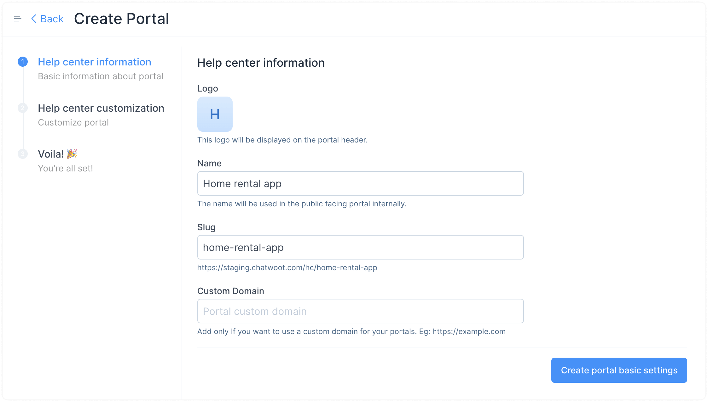
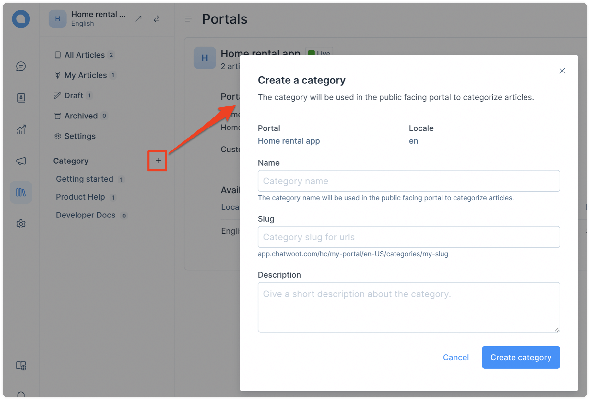
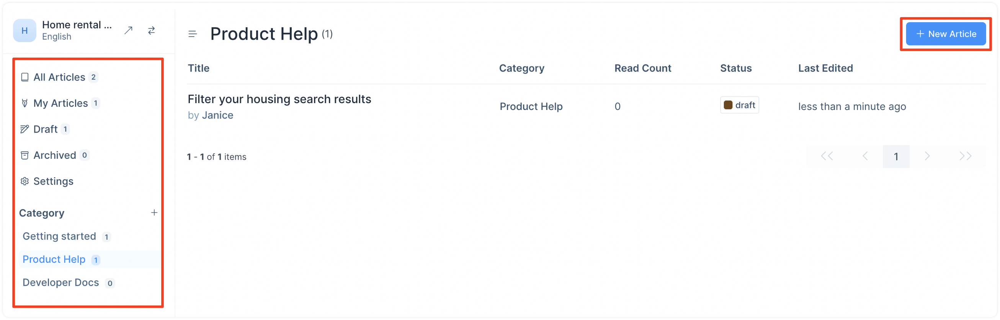
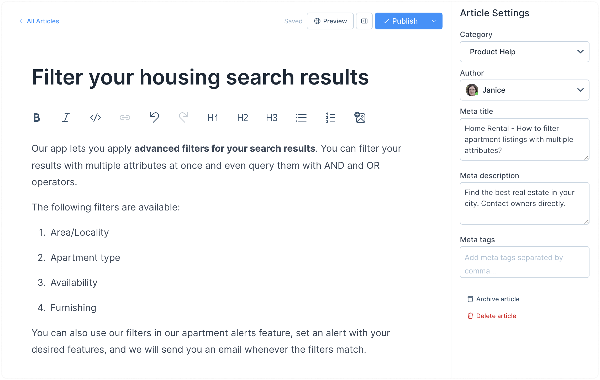
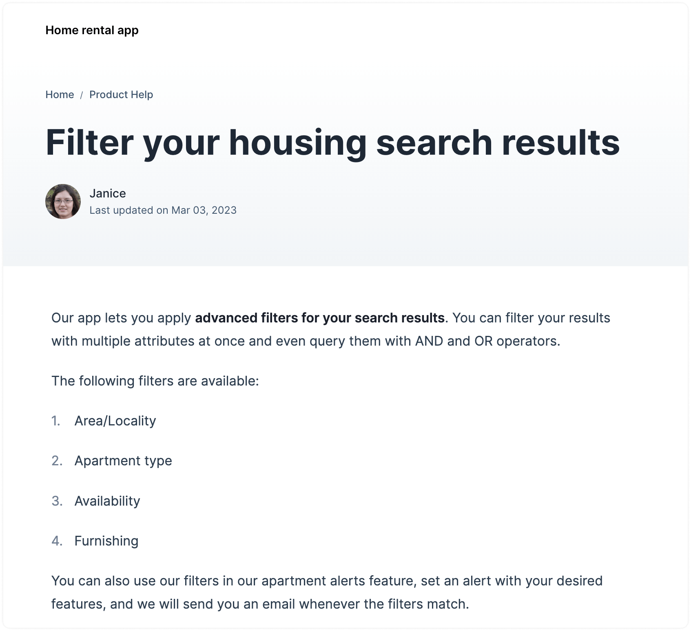

With the Help Center feature, you can easily create a self-service portal for your customers to access articles and information. In this guide, we take you through the steps to set up a Help Center, including creating a portal and adding articles.

Please note that this is a beta feature that will constantly get updated with every release. You can set up your Help Center in three parts, as explained below.

## I. Creating a portal

**Step 1.** Click the Help Center icon from your sidebar, and click the "New Portal" button.

**Step 2.** You will see a basic settings page. Start filling in the fields.

These fields are explained below:

1. **Logo**

   Upload your organization's logo.

2. **Name**

   Name your portal to refer to it internally.

3. **Slug**

   This will be auto-generated.

4. **Custom Domain (optional)**

   You can add the domain you want to serve your portal on a custom domain. For example, if your website is `yourdomain.com` and you want your portal accessible at `docs.yourdomain.com`, type that in this field.

Click "Create portal basic settings".

Your portal is ready. You can start adding categories and articles within these categories.

## II. Creating categories

Categories exist to structure your portal and organize your articles. Follow these steps:

**Step 1.** Click the `+` sign alongside the Category section on the secondary sidebar to create a new category.

**Step 2.** A modal will open up. Fill up the fields.

These fields are described below.

1. **Name**

   Name your category. This name will be used on the public portal.

2. **Slug**

   This will be auto-generated.

3. **Description (optional)**

   Describe your category.

Click the "Create category" button.

## III. Creating articles

Finally, start writing your articles. Follow the steps below.

**Step 1.** You can find the "New Article" button on almost every page. Click it.

**Step 2.** Use the text editor to write your article. Use the sidebar to select your article's category and author and update the meta content. Here is an example:

You can use the "Preview" button to see how your article turns out. Once ready, click "Publish". Your live article will look like this:

