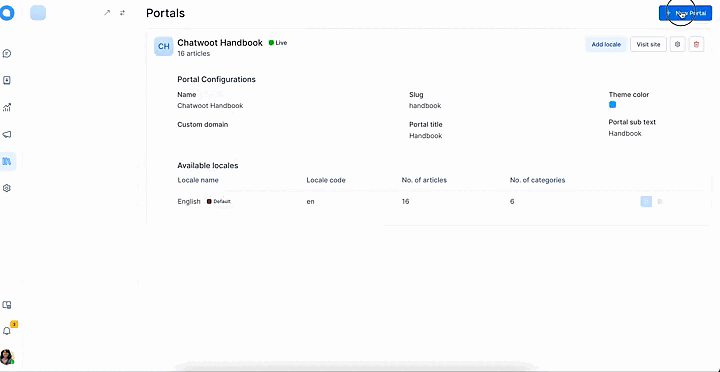
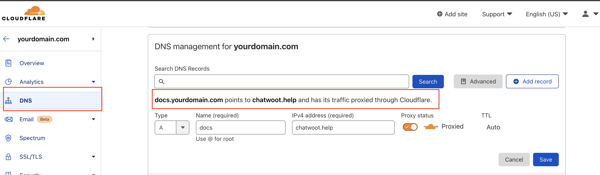
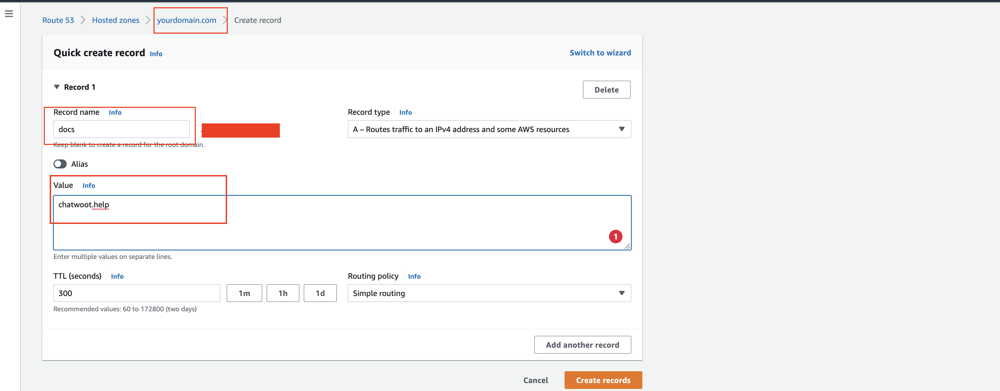
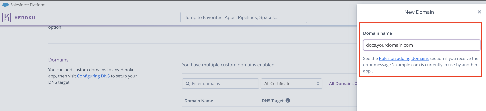
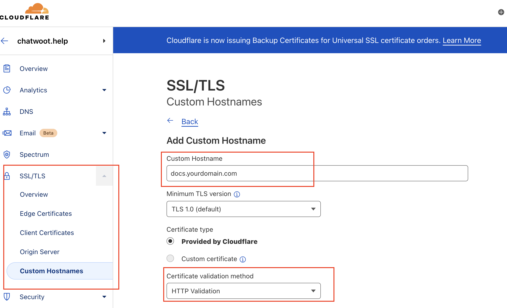

Help center allows you to create a portal and add articles from the chatwoot app dashboard. You can point to these help center portal articles from your main site and display them as your public-facing help center.
We provide SSL certificate for your help docs through our chatwoot domain.

## How to get SSL certificate for your custom domain

### Create a Portal in Chatwoot's dashboard

Let's create a product documentation portal for `yourdomain.com`, we will use this for the custom-domain `docs.yourdomain.com`

1. Navigate to Help Center
2. Click on "New Portal."
3. Add basic information about your portal.
  - Add a custom domain at which you want to serve your portal: e.g. yourdomain.com is your main site, and you want your portal at `docs.yourdomain.com`, then this will be your custom domain.
  - Add portal name; this will be the heading of your portal
  - slug is auto-generated `do not change it`.
4. Add customization information about the portal for theme color, page title, header text and homepage. This can match the theme and style on `yourdomain.com`.
5. Your portal is ready with no articles. To add articles, click on the portal settings button and add new categories and add articles in the respective category.

Once these steps are completed, you will have a portal with articles ready.

### Point your custom domain to chatwoot.help

1. Go to your nameserver, go to its DNS settings and add a new CNAME record.
   - For the above example, add docs as a CNAME record and point it to the chatwoot.help
   - For the Cloudflare nameserver, please below the attached image for reference. It's under DNS tab.

   

   - For the AWS nameserver, please see below-attached image for reference. It's under Route53 service.

   

   - If you have a different name server, these settings will be similar. Just go to the DNS settings and add a CNAME record. Or search for `How to add CNAME record with your nameserver?`.
2. This will ensure that your CNAME record points to our server. For your custom domain, we have your portal information and the SSL certificate. In this case, `docs.example.com`

### Providing SSL

1. This process is handled by chatwoot for all the cloud customers.
2. You need to reach out to us through Chatwoot support with your portal custom domain record.
3. Or please email us with the subject "Issue SSL certification for {Portal Slug}"

#### NOTE: This step will take 1/2 working day/s from the chatwoot team for the setup.

Voila!

`docs.yourdomain.com` is live with a secure connection, and your portal data is visible.

### How does this work?

These are the engineering details to understand `How does docs.yourdomain.com` gets the portal data with SSL certificate.

1. When the customer point docs.yourdomain.com to chatwoot.help through CNAME, DNS points it to our site, but it's not valid yet.
2. Then Customer from the browser requests us to serve `docs.yourdomain.com` endpoint with the portal's data.
4. To validate the routing from `docs.yourdomain.com` to `chatwoot.help`, we add a record in our heroku.
  - This is to validate Heroku DNS routing and validate the custom domain.
  - Go to Heroku `dashboard -> Chatwoot -> Settings`
  - Go to Domains section and add a new domain to serve, in this case, `docs.yourdomain.com`

  

  - After we add the domain successfully and ACM status will be waiting to verify the cert issue and will show an error later as SSL is not yet provided for the custom domain.

  

5. Heroku won't allow serving `docs.yourdomain.com` until we provide the SSL certificate.
6. For this, we go to our Cloudflare dashboard and certify the record for `docs.yourdomain.com`
   - Go to Cloudflare dashboard -> chatwoot.help
   - Go to SSL/TLS -> custom hostname
    

   - Add a record for docs.yourdomain.com, with certification validation method `HTTP Validation` and certificate type `Provided by Cloudflare
7. Wait till the custom hostname reflects with SSL certificate active.
8. Go back to Heroku and check the ACM status for the `docs.yourdomain.com` shows `Ok` now.

Cloudfare's custom hostname functionality provides the certificate to the custom domain that we add.

1. `docs.yourdomain.com` resolves by customers nameserver and redirects to chatwoot.help.
2. `chatwoot.help` nameserver certifies the `docs.yourdomain.com`
3. Chatwoot's heroku domain's settings validate the certificate and routes to chatwoot.help root dashboard.
4. `chatwoot.help` check for the portal record with custom-domain `docs.yourdomain.com`
5. Redirects to the portal records for the domain `docs.yourdomain.com`
 - 

Yaay!!

Now you can have your own help-center, product-documentation related portal saved at Chatwoot dashboard and served at your domain with SSL certificate.
