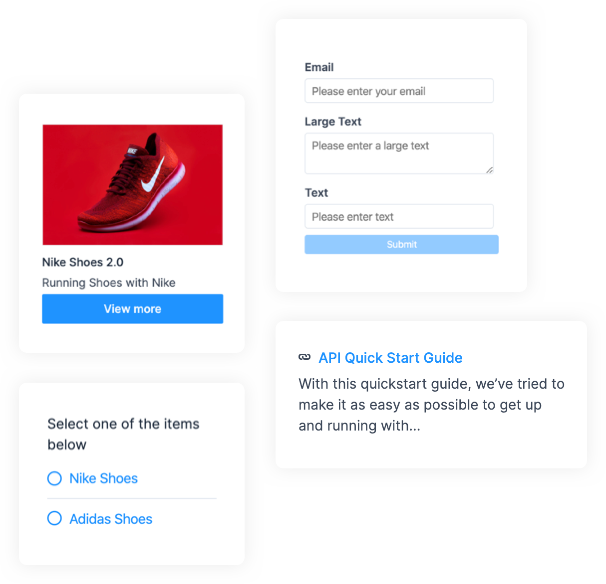

Chatwoot lets you create interactive message types like cards and forms in side your Chatwoot Web Widget using the APIs.

You can create these messages using the [New Message API.](https://www.chatwoot.com/developers/api/develop/#operation/create-a-new-message-in-a-conversation)



### Payload Samples

Use the following payload samples as the values to create various interactive messages.

#### 1. Options

```json
{
    "content": "Select one of the items below",
    "content_type": "input_select",
    "content_attributes": {
        "items": [
            { "title": "Option1", "value": "Option 1" },
            { "title": "Option2", "value": "Option 2" }
        ]
    },
    "private":false
}
```

#### 2. Form

```json
{
    "content_type": "form",
    "content_attributes": {
        "items": [
            { "name": "email", "placeholder": "Please enter your email", "type": "email", "label": "Email", "default": "xyc@xyc.com" },
            { "name": "text_aread", "placeholder": "Please enter text", "type": "text_area", "label": "Large Text", "default": "Sample text" },
            { "name": "text", "placeholder": "Please enter text", "type": "text", "label": "text", "default": "sample input" }
            {"name": "select","label": "Select Option", "type": "select", "options": [{ "label": "🌯 Burito", "value": "Burito" },
          { "label": "🍝 Pasta", "value": "Pasta" }]  }

        ]
    },
    "private":false
}
```

#### 3. Cards

```json
{
   "content": "card message",
   "content_type":"cards",
   "content_attributes":{
      "items":[
         {
            "media_url":"https://assets.ajio.com/medias/sys_master/root/hdb/h9a/13582024212510/-1117Wx1400H-460345219-white-MODEL.jpg",
            "title":"Nike Shoes 2.0",
            "description":"Running with Nike Shoe 2.0",
            "actions":[
               {
                  "type":"link",
                  "text":"View More",
                  "uri":"google.com"
               },
               {
                  "type":"postback",
                  "text":"Add to cart",
                  "payload":"ITEM_SELECTED"
               }
            ]
         }
      ]
   },
   "private":false
}
```

#### 4. Articles


```json
{
    "content_type": "article",
    "content_attributes": {
        "items": [
            { "title": "API start guide", "description": "A random start api guide", "link": "http://google.com" },
            { "title": "Development docs", "description": "Development docs and guidelines", "link": "http://google.com" }
        ]
    },
    "private":false
}
```
