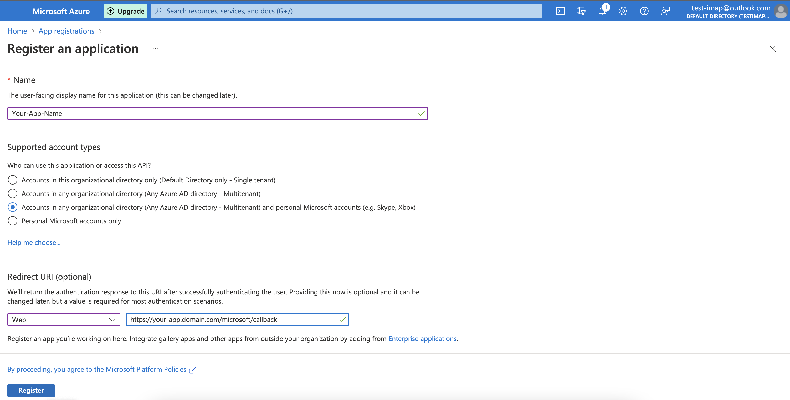
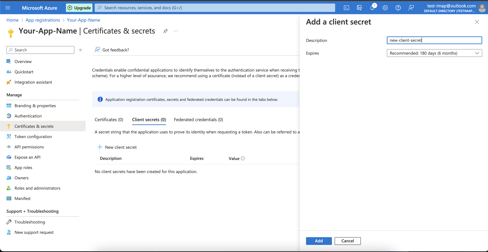
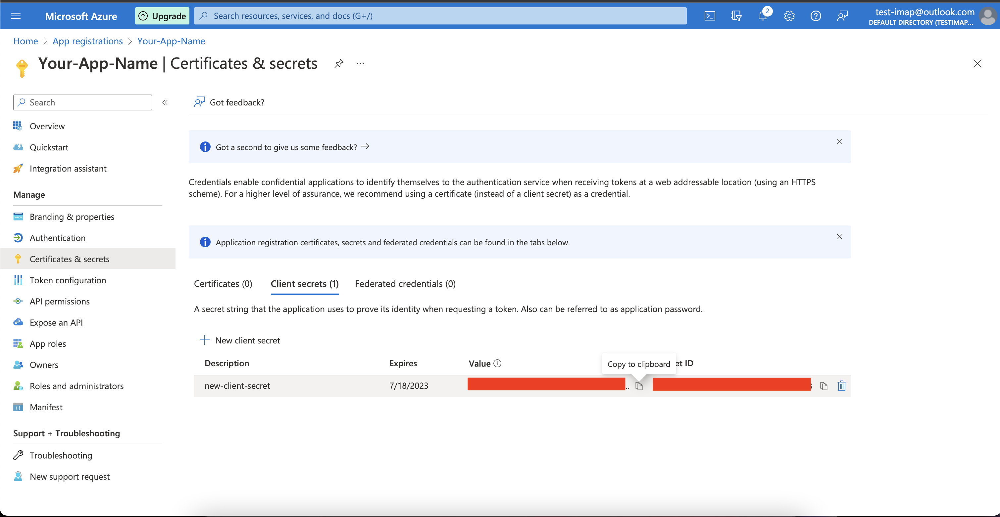
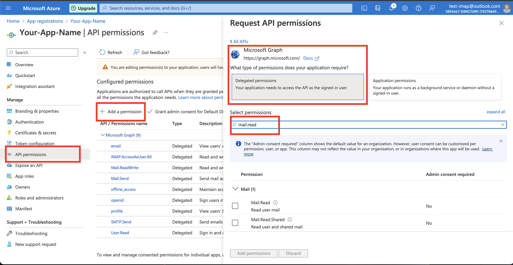
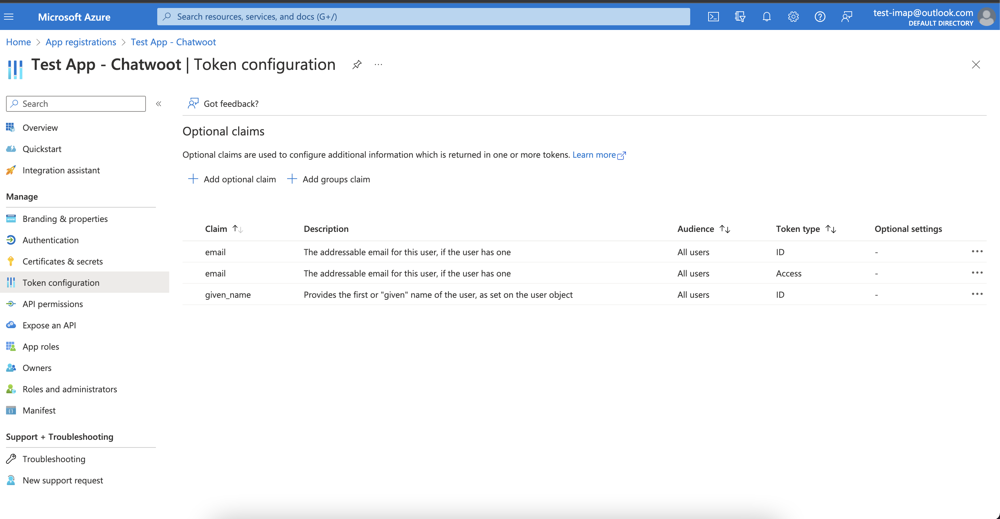
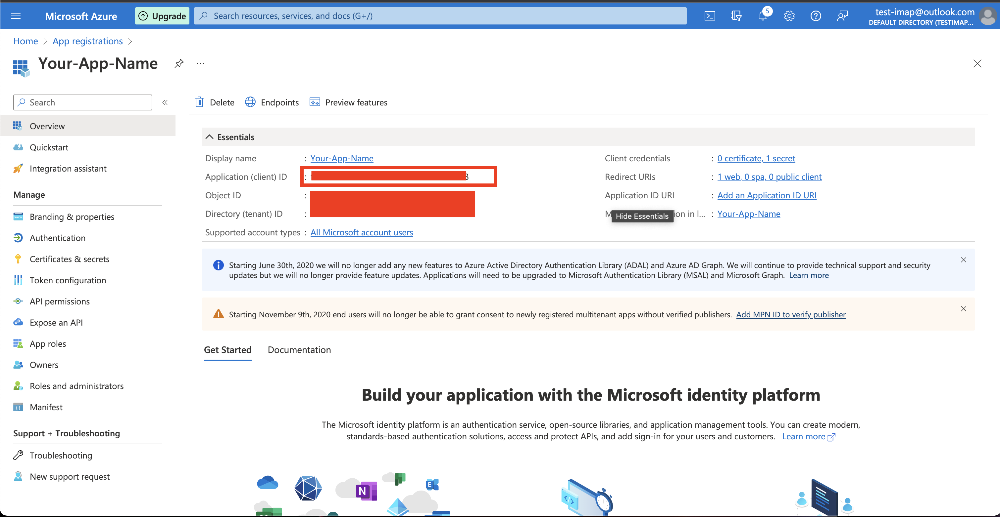
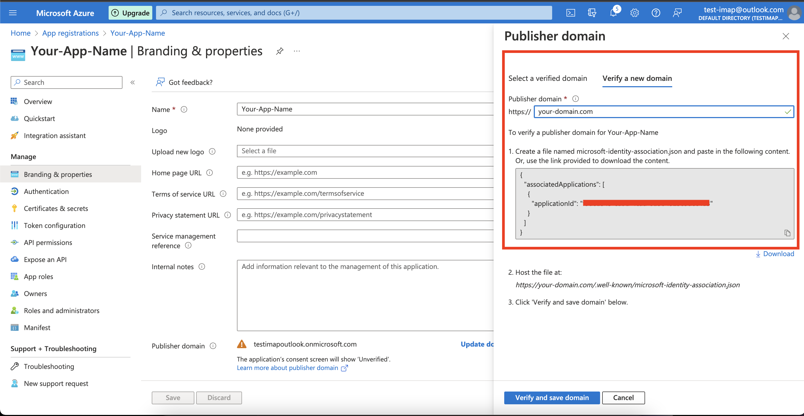

Since [Microsoft deprecating the Basic Auth flow](https://learn.microsoft.com/en-us/exchange/clients-and-mobile-in-exchange-online/deprecation-of-basic-authentication-exchange-online). We will not be able to send/receive outlook emails in our email channel inbox with basic authentication, now we will need to implement the Oauth2.0 flow and get the access tokens from the Azure app. To implement this in your self-hosted version follow the below steps.

### Register An Azure App

To add email channel inbox for outlook email, you have to create azure app in the Microsoft Azure portal. You can find more details about creating Azure App [here](https://learn.microsoft.com/en-us/azure/active-directory/develop/quickstart-register-app).

1. In the app registration page, click on `New Registration` and select the any account type.

Once you register your Azure App, make sure you add proper account type according to your use and add redirect URL for your domain `https://{your-domain}/microsoft/callback`.
You can find more details about redirect URL [here](https://learn.microsoft.com/en-us/azure/active-directory/develop/reply-url).



2. Then click on `Certificates & Secrets` tab and add new secret key for your application.



3. Then copy the client secret value immidiately after adding the key and store it somewhere, this is your `client_secret`.



4. Click on `API permissions` and add all the permission shown below to integrate email inbox.
You can find more details about it [here](https://learn.microsoft.com/en-us/azure/active-directory/develop/permissions-consent-overview).



5. Click on `Token Configuration` and add optional claims shown in the image.



### Configuring the Environment Variables in Chatwoot

Configure the following Chatwoot environment variables with the values you have obtained during the Azure app setup.
`AZURE_APP_ID` should be a unique application id or client id you get while configuring the Azure app.



`AZURE_APP_SECRET` is nothing but the `client_secret` you got in the third step.

Restart the chatwoot server after updating the environment variables

```bash
AZURE_APP_SECRET=
AZURE_APP_ID=
```

### Testing the Azure app with outlook email channel

Until the application is verified for production, You will see unverified during the authorization from the authorization prompt.
To test the changes until the app is verified for production. You should use the azure app registration email address in chatwoot channel and you would be able to test the flow on your local or any other instance.

### Going into production.

Before you can start using your Azure app in production, you will have to get it verified by Azure. Refer to the [docs](https://learn.microsoft.com/en-us/azure/active-directory/develop/howto-configure-publisher-domain) on getting your app verified. And learn more about publisher verification [here](https://learn.microsoft.com/en-us/azure/active-directory/develop/publisher-verification-overview)

1. Go to: `Branding & Properties` and add your domain details, and then click `Verify and Save.`



We are handling the mentioned steps about the hosting  `microsoft-identity-association.json`.
Once you set `AZURE_APP_ID` in your environment variable, consider this step is completed.

### Next steps

You're done! Next, you should [enable the outlook email channel](https://www.chatwoot.com/docs/product/channels/email/microsoft/create-channel) in chatwoot inbox.

Consider `test-imap@outlook.com` is an email for which you are adding a new inbox.


### NOTE

You need to get your publisher verified to be able to attach and fetch mails from the Azure app with any other outlook email.