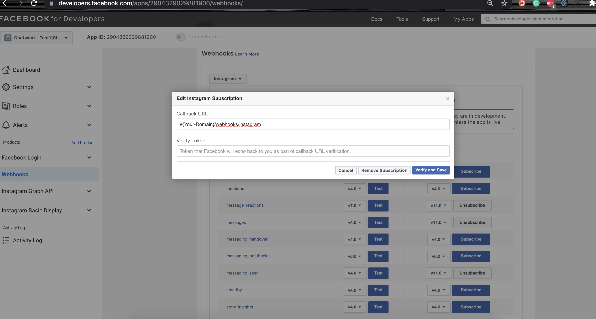

### Register A Facebook App

To use Instagram Channel, you have to create a Facebook app in the developer portal. You can find more details about creating Facebook channels [here](https://developers.facebook.com/docs/apps/#register)

1. In the select an app type, choose `business`

Once you register your Facebook App, you will have to obtain the `App Id` and `App Secret`. These values will be available in the app settings and will be required while setting up Chatwoot environment variables.

### Configuring the Environment Variables in Chatwoot

Configure the following Chatwoot environment variables with the values you have obtained during the Instagram app setup.
`IG_VERIFY_TOKEN` should be a unique secure string that should be provided when configuring the Instagram app.

Restart the chatwoot server after updating the environment variables

```bash
IG_VERIFY_TOKEN=
FB_APP_SECRET=
FB_APP_ID=
```

### Configure the Facebook App

1. In the app settings, add your `Chatwoot installation domain` as your app domain.

2. In the products section in your app settings page, Add `Instagram Graph Api`

3. Go to the Webhook settings and configure the callBack URL with `{your_chatwoot_url}/webhook/instagram`

4. provide the `IG_VERIFY_TOKEN` value from your environment variables for `verify token`
5. Make sure your Facebook page is connected to the Instagram account, for which the Instagram account holder is admin.
You can do that setting here:
  > Go to https://www.facebook.com/pages/?category=your_pages
  > Select Your Page
  > Go to Settings
  > Select Instagram: Make sure you have a business account https://developers.facebook.com/docs/messenger-platform/instagram/get-started
  > Connect your Instagram account.
  So whenever you receive any message on Instagram, it will redirect to your Facebook page.
5. Head over to chatwoot and create a Messenger inbox. Choose a page for which your Facebook developer account and Instagram account have admin access.


### Testing the Facebook channel

Until the application is approved for production, Facebook wouldn't send the new messages on your page to chatwoot.
To test the changes until the app is approved for production. Follow the steps

1. Create a Test app for your app. Follow all the above steps for the test app.
2. Add extra product for the test app: Instagram Basic Display
3. Head over to the Instagram Basic Display section on your test app settings page, in Facebook developers.
4. Add Instagram Testers in the settings.
5. Click on Edit subscriptions under Webhook > Instagram and subscribe to the following
```
message_reactions
messages
messaging_seen
```


4. Send a message to the connected Instagram account from Instagram Testers, and it should appear in chatwoot now

### Going into production.

Before you can start using your Facebook app in production, you will have to get it verified by Facebook. Refer to the [docs](https://developers.facebook.com/docs/messenger-platform/instagram/app-review) on getting your app verified.

Obtain advanced access to the required permissions mentioned below for your Facebook app
```
instagram_manage_messages
instagram_basic
pages_show_list
pages_manage_metadata
pages_messaging
```


### Developing or Testing Facebook Integration in your machine

Install [ngrok](https://ngrok.com/docs) on your machine. This will be required since Facebook Messenger APIs will only communicate via https.

```bash
brew cask install ngrok
```

Configure ngrok to route to your Rails server port.

```bash
ngrok http 3000
```

Go to the Facebook developers page and navigate into your app settings. Add `localhost` as your app domain and add a privacy policy URL in the app settings.
In the Webhook > Instagram settings shown in the above image, configure the callback url with the following value.

```bash
{your_ngrok_url}/webhook/instagram
```

Update verify token in your Chatwoot environment variables.

You will also have to add a Facebook page to your `Access Tokens` section in your Messenger settings page.
Restart the Chatwoot local server. Then, your Chatwoot setup will be ready to receive Facebook messages.

### Test your local Setup

1. After finishing the setup above, [create a Messenger inbox](/docs/product/channels/facebook) after logging in to your Chatwoot Installation.
2. Send a message to your Facebook Page from your Instagram account.
3. Wait and confirm incoming requests to `/webhook/instagram` endpoint in your ngrok screen.
4. You can also verify your callback URL by clicking on Test for the subscribed Instagram fields.
Go to webhook Instagram and click on Test with `v11.0`


### NOTE:
You can have only one app connected to the chatwoot for Instagram and Facebook combined as the Messenger platform is common. But suppose you want to have separate channels for Instagram and Facebook. In that case, you can have multiple Facebook pages inside your app that would be connected to Facebook users and Instagram users separately and then connected to the different inbox in the chatwoot page.
