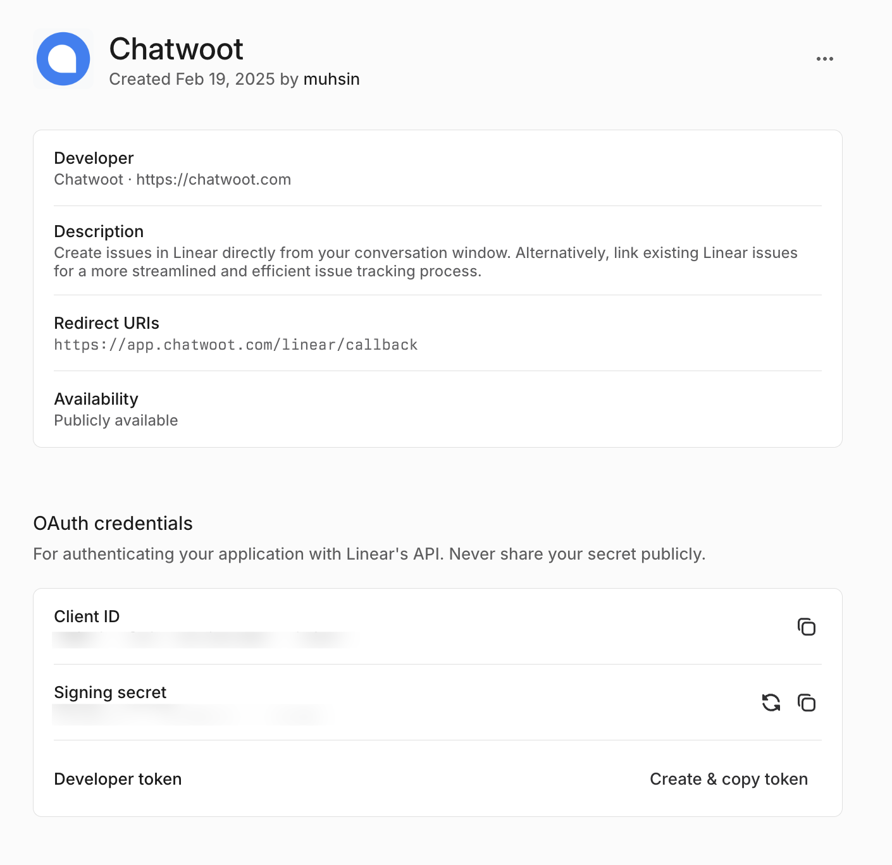

Setting up Chatwoot Linear integration involves 5 steps.

1. Create a linear app in the [developer portal](https://linear.app/settings/api/applications/new).
2. Add necessary details and save the app.
3. Configure Chatwoot with the `Client ID` and `Signing Secret` obtained from the linear app.
4. Open Chatwoot UI, navigate to integrations, Linear and click connect.
5. Voila! You should be able to use linear in your Chatwoot account.

## Register and configure the Linear app

To use Linear Integration, you have to create a Linear app in the developer portal. You can find more details about creating Linear apps at the [Linear developer portal](https://developers.linear.app/docs/oauth/authentication).


1. Create a Linear app.
2. Obtain the `Client Id` and `Client Secret` for the app and configure it in your `{Chatwoot installation url}/super_admin/app_config?config=linear`
3. The callback URL should be `{Chatwoot installation url}/linear/callback`.
4. Toggle the `Public` switch to make the app public.





## Configure the environment variables in Chatwoot

Obtain the `Client ID` and `Client Secret` for the app and configure it in your Installation config it in the `{Chatwoot installation url}/super_admin/app_config?config=linear`. These values will be available when you create the app in the developer portal.

```bash
LINEAR_CLIENT_ID=
LINEAR_SIGNING_SECRET=
```

Restart the Chatwoot server.


> **Note**: Linear will only show up in the integrations section once you have configured these values and restarted the server.

## Connect Chatwoot with your Linear account

Follow this [guide](https://chatwoot.help/hc/user-guide/articles/1739949089-how-to-track-issues-and-features-with-linear-integration) to complete the Linear integration.