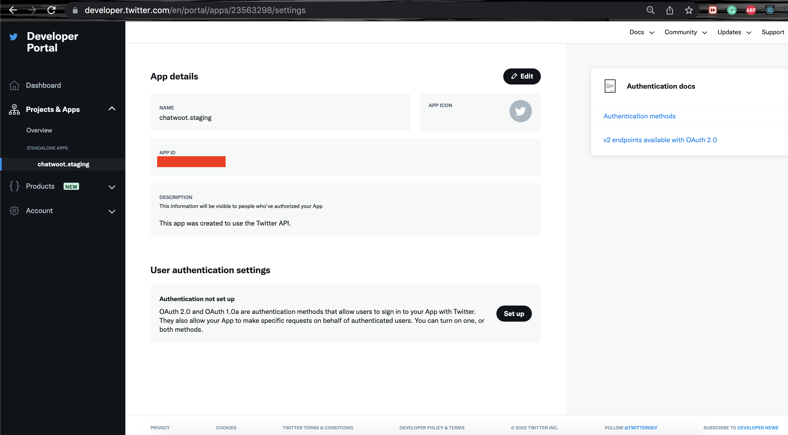
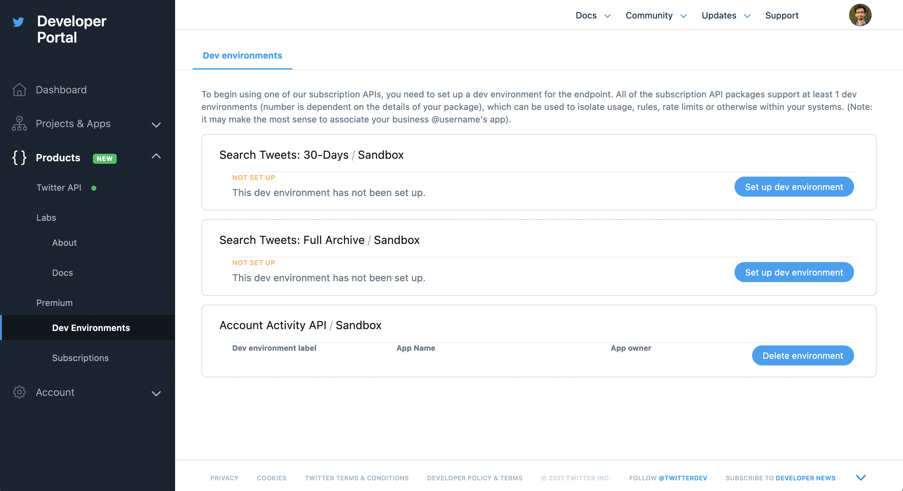

Twitter channel with Chatwoot requires access to Twitter APIs. We are using Account Activity API. If you don't have an access to Twitter Business APIs, apply for one at [Twitter developer portal](https://developer.twitter.com/en/apply-for-access).

Once your application is approved, you will be able to add Twitter Apps and dev environments. If you have applied for a team account, you will able to invite more team members. Inorder for the channel to work you will have to set the following environment variables. We will describe what it means in the following sections.

```bash
TWITTER_APP_ID=
TWITTER_CONSUMER_KEY=
TWITTER_CONSUMER_SECRET=
TWITTER_ENVIRONMENT=
```

### Create a Twitter App

Go to [Projects & Apps Overview Console](https://developer.twitter.com/en/portal/projects-and-apps) in Twitter Developer Portal. Go to "Standalone Apps" section. Click on "Create App" button.


Provide an app name and click on "Next".


You will be able to see the `API Key` and `API Secret Key` in the next step. Save this information as it would not available again.

- Use `API Key` as `TWITTER_CONSUMER_KEY` in Chatwoot.
- Use `API Secret Key` as `TWITTER_CONSUMER_SECRET` in Chatwoot.


Hooray! The app is created now. Next step is to enable "Sign in with Twitter" permission.

### Complete profile information

Complete the application profile. See the "App Details" section as shown below. Update the name, logo and description. Use the "APP ID" displayed in the screenshot as `TWITTER_APP_ID` in Chatwot.



### Update app permissions

Head over to the "App Permissions" section. Update the permission to "Read and Write and Direct Messages".


### Enable 3-legged OAuth

Chatwoot uses "Sign-in with Twitter" which requires 3-legged OAuth to be turned on. Head over to Authentication settings in your app settings and click on "Edit".


Enable 3-legged OAuth. Add the callback url as `{your_chatwoot_installation_url}/twitter/callback`.


Complete the rest of the details in the authentication settings and click on "Save".

### Create a dev environment (required)

In order for the DMs and Tweets to work in realtime, you need to set up Account Activity API dev environment as follows. A Twitter development environment is required for **all** installations of Chatwoot.

URL: https://developer.twitter.com/en/account/environments

Head over to Products -> Premium -> Dev Environments. Click on `Set up dev environment`. You will be able to see a form as follows.


Provide a `Dev Environment Label`, this should be an alphanumeric string. Use the same string as `TWITTER_ENVIRONMENT` in Chatwoot.



Once you do this, you will ready to use Twitter Channels. To connect your Twitter Account, follow this [guide](/docs/product/channels/twitter).
