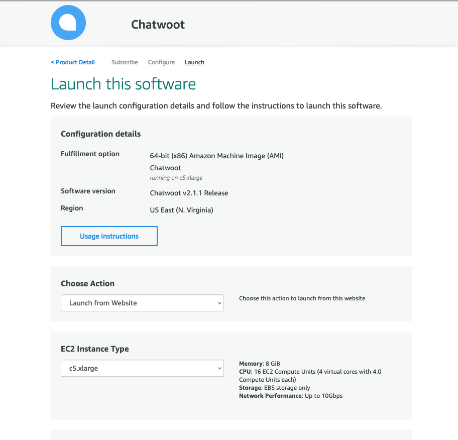
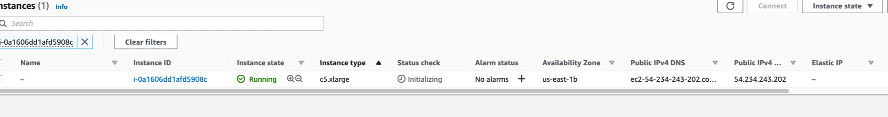

The following is the guide for deploying Chatwoot on AWS using the marketplace listing. Use our helm charts with AWS Elastic Kubernetes Service(EKS) for a cloud-native deployment.

### Prerequisites
- AWS account

## Install Chatwoot via AWS marketplace AMI

1. Go to [Chatwoot AWS marketplace listing](https://aws.amazon.com/marketplace/pp/prodview-tolblk4kmdqd4) and click on subscribe.


2. Sign in with your AWS account.


3. Click on `Continue to Configuration`.


4. Select the latest version in `Software Version` and pick your aws `region`. Click `Continue to Launch`.


5. Review the launch configuration. Leave the `Choose Action` field with the default value `Launch from Website`. Choose a VPC and subnet as per your AWS region preference.


6. Scroll down to the `security group` section and click create `Create New Based On Seller Settings.`


7. Save the new security group and choose it after creation.


8. Pick a key pair you already have or create a new one in the region you are deploying. Click `Launch`.


9. AWS should now display a congratulations screen confirming that Chatwoot instance is launched successfully. Click on the `EC2 Console` link.


10. Wait for a few minutes to let the instance come up.


11. Select the instance and copy the public IP.


12. To ensure a static IP, create an Elastic IP and associate it with the instance.

13. Visit `http://<your-public-ip>:3000`. This should bring up the Chatwoot UI. Congratulations. Woot ! Woot !!


14.Configure the IP to your domain/subdomain as needed.


## Configuring Chatwoot

To configure Chatwoot, we need to ssh into the instance. We will use `AWS console connect` for this.

1. Select the instance and click on `Connect`.


2. Change the username from `root` to `ubuntu` and click `Connect`.


3. Switch to the `chatwoot` user and configure the necessary environment variables. Refer [Environment variables](https://www.chatwoot.com/docs/self-hosted/configuration/environment-variables) document for the complete list.
```bash
sudo -i -u chatwoot
cd chatwoot
vi .env
```

4. To add SSL, use the command:  ```sudo cwctl -w``` Provide your domain/subdomain and email address for SSL certificate generation.

5. For additional options, use ```sudo ctctl -help``` 

### Updating the instance
Please follow the Chatwoot update process in the standard Linux VM setup.
