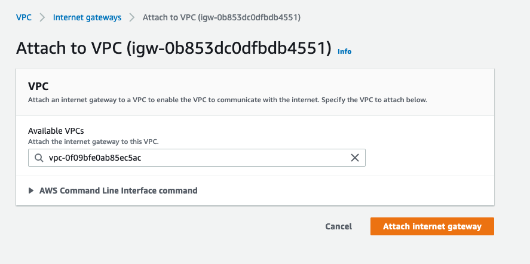
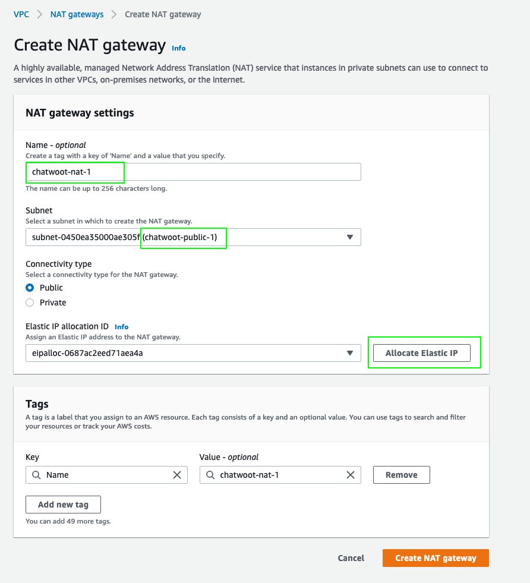

The following guide is reference architecture for deploying Chatwoot on AWS.

## Introduction

We will use the linux installation script to get a chatwoot instance up and running. Also instead of
relying on redis, postgres and nginx installed in the same ec2, we will proceed to make use
of managed aws services for the same viz Elasticache, RDS and ALB.

### Prerequisites

1. AWS account
2. Domain to use with Chatwoot

### Architecture

This guide will follow a standard 3-tier architecture on aws. 


## Network

### Create VPC

1. Sign into AWS console and pick the region you are going to deploy.
2. Navigate to the VPC console and create a new vpc for chatwoot. At the `name` tag, enter
   `chatwoot-vpc` and use the CIDR block `10.0.0.0/16`.
3. Leave the rest of the options as default and click on `Create VPC`.


### Subnets
Create two public and private subnets in the vpc we created. Make sure to have then in different AZ's and have non-overlapping CIDR ranges.

1. Navigate to VPC > Subnets.
2. Click on `Create Subnet`. Select the `chatwoot-vpc` we created before, name it as `chatwoot-public-1`, select an availability zone (for example, ap-south-1a) and the CIDR block as
`10.0.0.0/24`.


3. Follow the same to create the remaining subnets.

| Name                | Type     | Availability Zone  | CIDR Block    |
| ------------------- | -------- | ------------------ | ------------- |
| `chatwoot-public-1`  | public  | `ap-south-1a`      | `10.0.0.0/24` |
| `chatwoot-public-2`  | public  | `ap-south-1b`      | `10.0.1.0/24` |
| `chatwoot-private-1` | private | `ap-south-1a`      | `10.0.2.0/24` |
| `chatwoot-private-2` | private | `ap-south-1b`      | `10.0.3.0/24` |

4. After creating all subnets, enable `auto assign public ipv4 address` for public subnets under `Actions` > `Subnet Settings`.

### Internet Gateway

1. Select  `Create Internet Gateway` , name it as `chatwoot-igw` and click create.
3. Select it from the internet gateways list, choose actions and then select `Attach to VPC`.
4. Choose `chatwoot-vpc` and click attach.



### NAT Gateway

Chatwoot app servers will be deployed in the private subnet. For them to access internet, we need to add NAT gateways to our public subnet and add a route from the private subnets.

1. Navigate the VPC dashboard and select `NAT gateways`.
2. Click `Create NAT Gateway`.

    1. Name it as `chatwoot-nat-1`.
    2. Select the `chatwoot-public-1` subnet.
    3. Click on `Allocate Elastic IP`.
    4. Add additional tags as per your need.
    5. Click `Create NAT gateway`.



3. Follow the same to create a second NAT gateway (`chatwoot-nat-2`) and choose the `chatwoot-public-2` subnet.
### Route tables

Route table controls the inbound and outbound access for a subnet.
#### Public Route table

We will create route tables so that our public subnets can reach the internet via the Internet gateway.

Navigate to the VPC dashboard and select `Route Tables`.
1. Click `Create route table`.
2. Use the name `chatwoot-public-rt` and choose the `chatwoot-vpc` under VPC.
3. Click `Create`.


Next, we need to add a route to the internet gateway we created earlier(`chatwoot-igw`).

1. Select the `chatwoot-public-rt` route table from the list and click on `Edit routes` > `Add Route`.
2. Set the destination as `0.0.0.0/0` and choose the target as `chatwoot-igw`. Click on `Save Changes`.

Also,

1. Select the `chatwoot-public-rt` route table from the list and click on `Subnet Associations` > `Edit subnet associations`.
2. Select both the public subnets(`chatwoot-public-1`,`chatwoot-public-2`) and click `save`.

#### Private Route table

We will also create private route tables so that our private subnets can reach the internet via the NAT gateways.

1. Follow the above guide and create two private route tables namely, `chatwoot-private-a` and `chatwoot-private-b`.
2. Select the route tables one by one and add a route to the NAT gateway in their respective availability zone.
    1. For `chatwoot-private-a`, add a route to `0.0.0.0/0` and target as `chatwoot-nat-1`.
    2. For `chatwoot-private-b`, add a route to `0.0.0.0/0` and target as `chatwoot-nat-2`.

Also,

1. Associate the private route tables with corresponding private subnets.
    1. For `chatwoot-private-a`, associate `chatwoot-private-1` subnet.
    2. For `chatwoot-private-b`, associate `chatwoot-private-2` subnet.

## Application Load Balancer (ALB)

Create an application load balancer to recieve traffic on port 80 and 443, and distribute it across Chatwoot instances. 

1. Navigate to the EC2 section and choose Load Balancer section.
2. Click `Create Load Balancer`.
    1. Choose `Application Load Balancer`.
    2. For the loadbalancer name, use `chatwoot-loadbalancer`.
    3. Select the scheme as `internet-facing` and IP address type as `IPv4`.
    4. For the network mapping section,
       1. Select the `chatwoot-vpc`.
       2. Select both the public subnets `chatwoot-public-1` and `chatwoot-public-2` under mapping section.
   5. For the Security group section,
       1. Create a new security group, `chatwoot-loadbalancer-sg`.
       2. Add rules to allow HTTP and HTTPS traffic from anywhere(`0.0.0.0/0`, `::/0`).
       3. Also add rules to allow SSH traffic.
   6. For Listeners and routing section, create two listeners for both 80 and 443.
       1. Also create a target group, `chatwoot-tg` that will forward the requests to port `3000`(Chatwoot listens on this port).
       2. Add a health check to the endpoint `/api`. This endpoint is not authenticated and should return the application version.
```
{
  "version": "1.22.1",
  "timestamp": "2021-12-06 16:07:39"
}
```
   7. Add any necessary tags and click create.

Also, add if you have your domain on Route53 and use ACM to generate a certifcate to use with ALB.

//TODO: expand more on the ACM part

## Postgresql using AWS RDS

Chatwoot uses Postgres as a DB layer and we will make use of Amazon RDS with a multi AZ option for reliablity. 

### RDS security group

1. Navigate to EC2 > Security groups and create a new sg.
2. Name it, `chatwoot-rds-sg`.
3. Select the `chatwoot-vpc` and add an inbound rule for postgres port with source `chatwoot-loadbalancer-sg`.

### RDS subnet group

1. Navigate to RDS section and select subnet groups.
2. Create `chatwoot-rds-group` and choose `chatwoot-vpc`.
3. Select both az's and the private subnets.

### RDS

1. Select create database.
2. Use standard create and choose the postgres engine.
3. Use the production template, create a postgres master username and password.
4. Enable Multi-AZ deployment.
5. Select `chatwoot-vpc` and selecte the rds security group we created earlier.
6. Enable password authentication.
7. Click create.
8. After the create is complete, note down the hostname, username and password. We will need this to configure Chatwoot.
## Redis using AWS Elasticache

//TODO: expand redis section

1. Follow similar steps like the rds to create a redis security group and subnet group.
2. Create the redis cluster with multi-AZ option.


## Creating Bastion servers

Create bastion servers in both public subnets. These servers will be used to ssh into chatwoots servers in private subnets.

1. Navigate to EC2 dashboard and click launch instance.
2. Use an `Ubuntu 20.04 image` with a `t3.micro` type.
3. Choose `chatwoot-vpc` and subnet `chatwoot-public-1`.
4. Name it as `chatwoot-bastion-a`.
5. Add a new sg, `chatwoot-bastion-sg` and enable ssh access from anywhere.
6. Leave the rest as defaults and click launch.
7

## Install Chatwoot

## Configure Chatwoot
## Verify login

## Create custom AMI


## ASG
- create launch config
- create asg
- terminate old instance

## Monitoring

## Updating Chatwoot
## Conclusion

### Known Limitations
