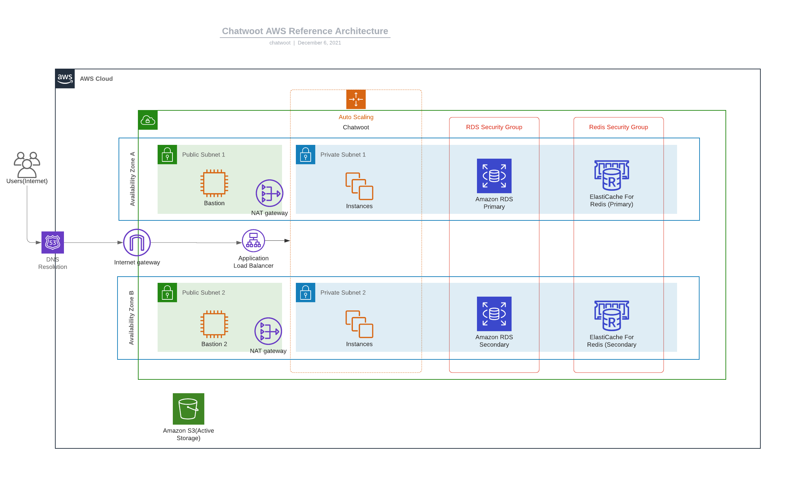

The following guide is reference architecture for deploying Chatwoot on AWS.

## Introduction

We will use the linux installation script to get a chatwoot instance up and running. Also instead of
relying on redis, postgres and nginx installed in the same ec2, we will proceed to make use
of managed aws services for the same viz Elasticache, RDS and ALB.

### Pre requisites

1. AWS account
2. Domain to use with Chatwoot

### Architecture

This guide will follow a standard 3-tier architecture on aws. 

## Network

### Create VPC

1. Sign into AWS console and pick the region you are going to deploy.
2. Navigate to the VPC console and create a new vpc for chatwoot. At the `name` tag, enter
   `chatwoot-vpc` and use the CIDR block `10.0.0.0/16`.
3. Leave the rest of the options as default and click on `Create VPC`.

### Subnets
1. Create two public and private subnets in the vpc we created. Make sure to have then in different AZ's and
have non-overlapping CIDR ranges.

### Internet Gateway

### NAT Gateway

### Route tables
- private
- public

## ALB

## Postgresql using AWS RDS

## Redis using AWS Elasticache

## Creating Bastion servers

## Install Chatwoot

## Configure Chatwoot
## Verify login

## Create custom AMI

## ASG
- create launch config
- create asg
- terminate old instance

## Monitoring

## Updating Chatwoot
## Conclusion

### Known Limitations
