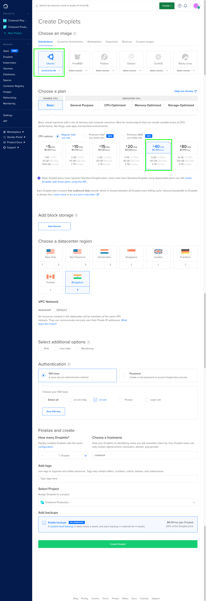

This guide will deploy chatwoot on a single droplet in DigitalOcean. For a cloud native deployment, go with
our [1-click k8s app on DigitalOcean Marketplace](https://marketplace.digitalocean.com/apps/chatwoot).

## Create a Droplet (VM)

1. Login to DigitalOcean console and choose create droplet.
2. Choose `Ubuntu 20.04` image.
2. Create an instance with a minimum of 4vCPU and 8GB RAM.
3. Make sure to choose the datacenter region you want to deploy.
4. Under authentication, choose your SSH key or create a new one. This is important as you will need
   this key to complete the next section.
5. Click create.

## Install Chatwoot

1. SSH into the droplet created above.
2. Follow the linux VM instructions at https://www.chatwoot.com/docs/self-hosted/deployment/linux-vm.
3. Woot! Woot! Your Chatwoot Instance is ready and can be accessed at `http://<your-droplet-ip>:3000`.  Or if you completed the domain setup during the installation, chatwoot should be available at `https://<your-domain>`

## Configure Chatwoot

1. Follow the Chatwoot docs to configure your domain, email and other parameters you need.
https://www.chatwoot.com/docs/self-hosted/deployment/linux-vm#configure-the-required-environment-variables
