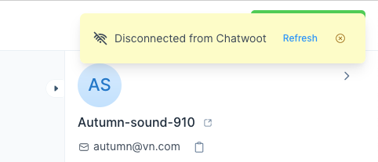

## Troubleshooting

### Disconnected from Chatwoot

Chatwoot uses WebSocket connections to deliver real-time messages. You will see the `Disconnected from Chatwoot` notification when this connection is broken.

Deployments using load balancers from major cloud providers might frequently experience this. This is due to the default idle timeout settings for Loadbalancer. Increase this limit to fix the problem.

For AWS, the default load balancer timeout is 60 seconds. Increase it to 3600 seconds or more. [Follow this guide.](https://docs.aws.amazon.com/elasticloadbalancing/latest/application/application-load-balancers.html#connection-idle-timeout)

For GCP, the timeout for a WebSocket connection depends on the `backend service timeout` of the load balancer, which is 30 seconds by default. Increase it to 3600 seconds or more. [Refer to this guide.](https://cloud.google.com/load-balancing/docs/https#timeouts_and_retries)

For Azure, the default timeout value is 240 seconds. Increase it to 3600 seconds or more. [Refer to this guide.](https://docs.microsoft.com/en-us/azure/load-balancer/load-balancer-tcp-idle-timeout)

