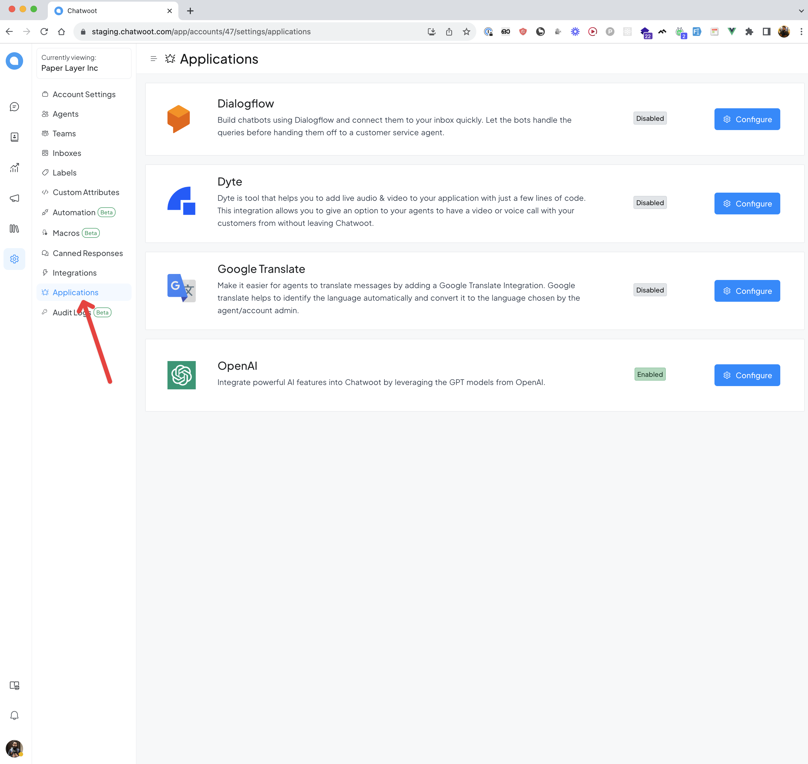
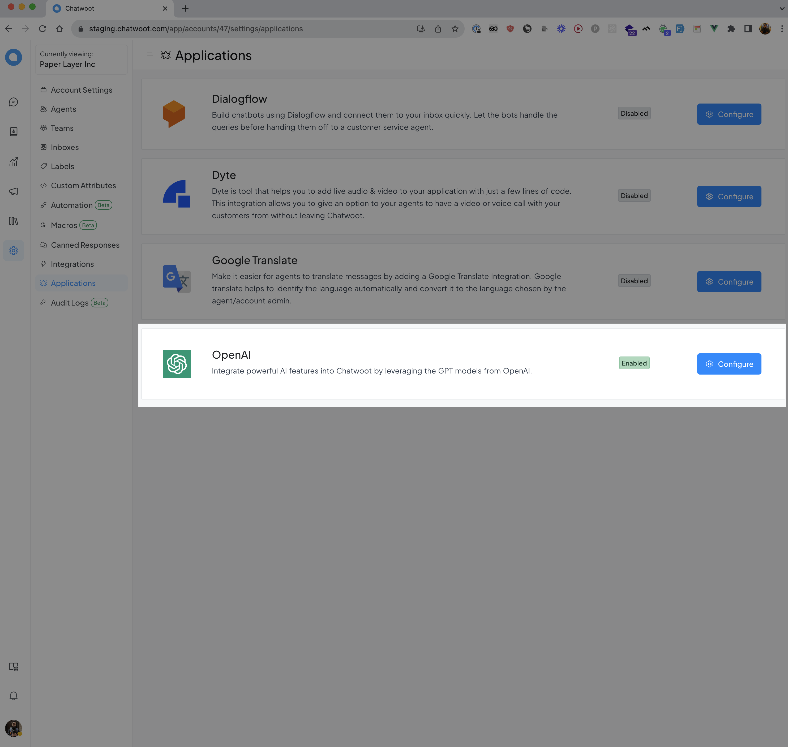
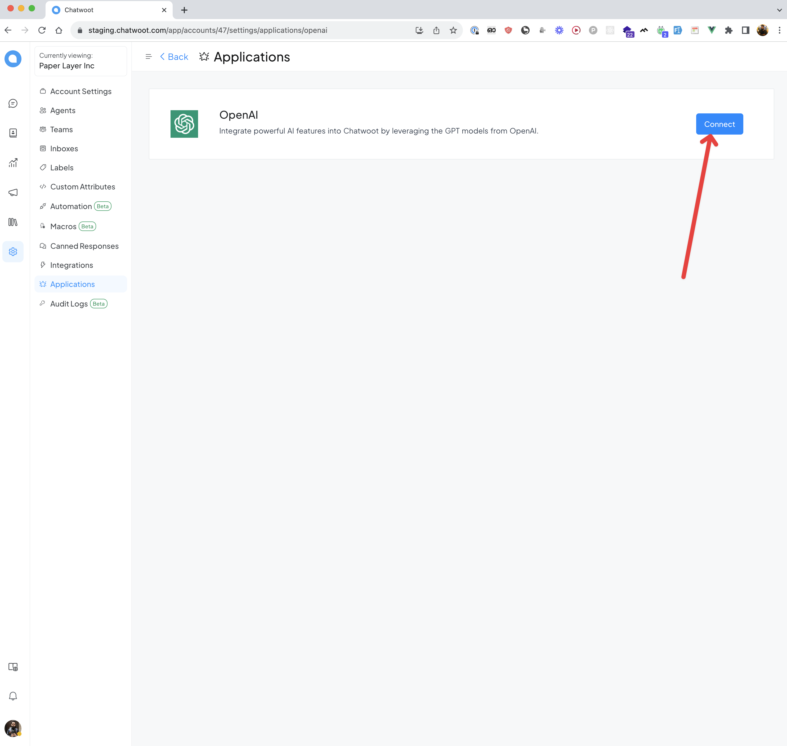
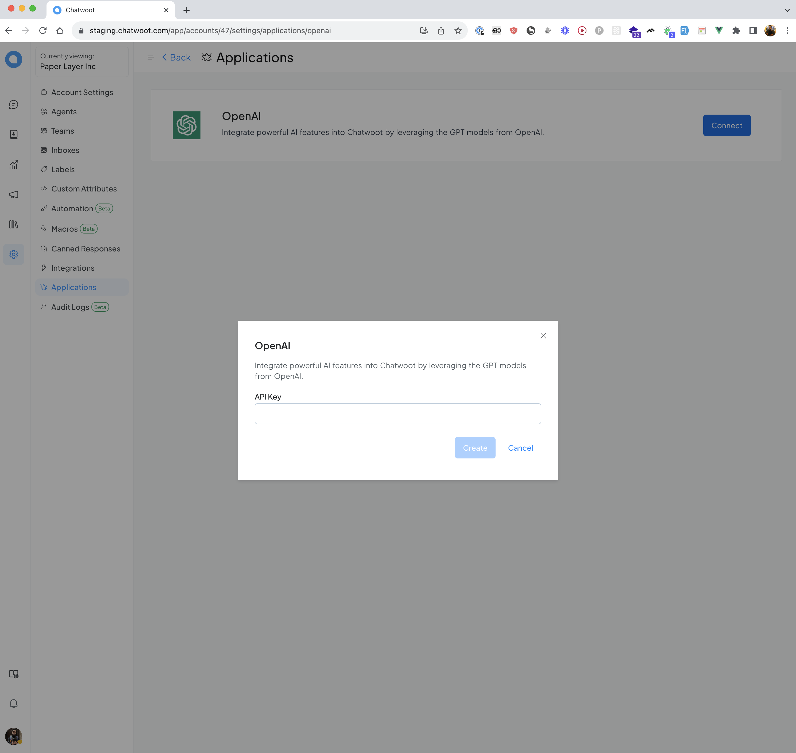
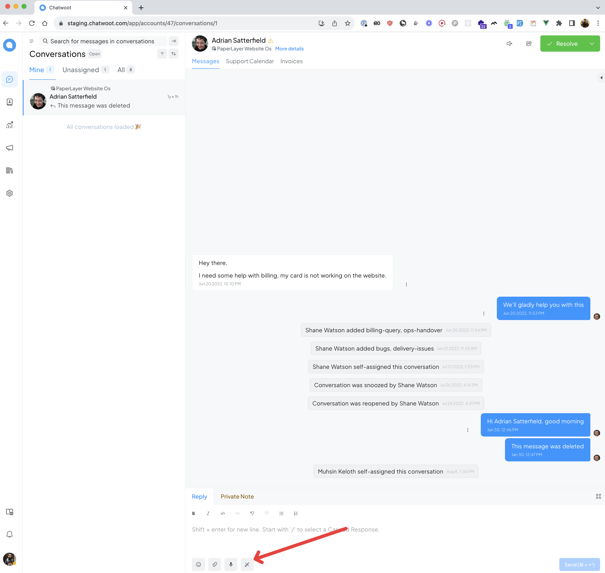
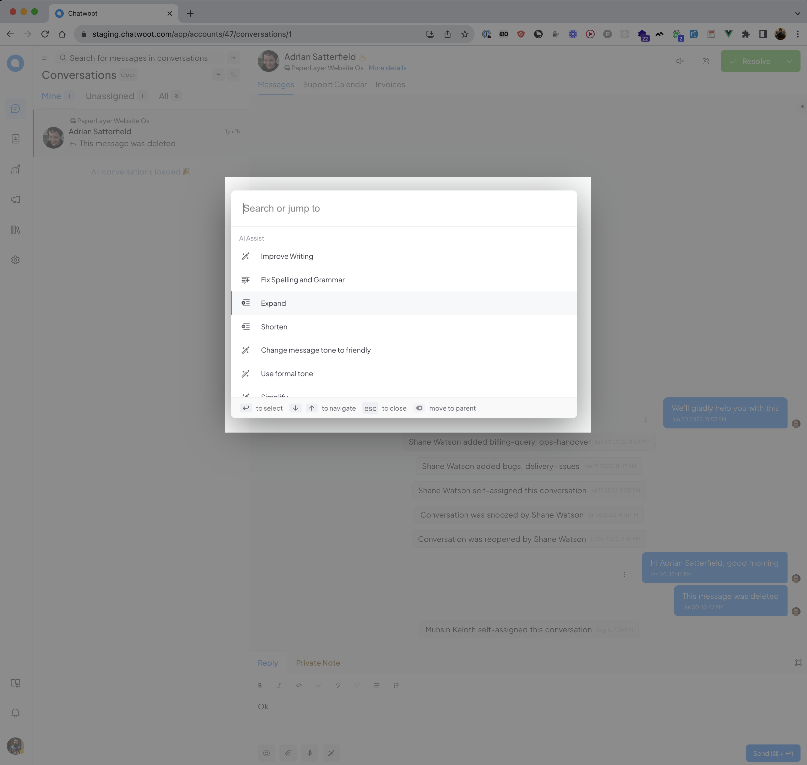
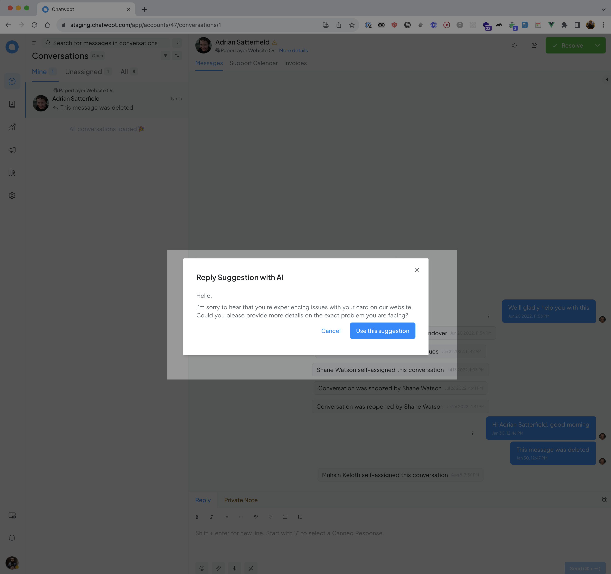

The AI Assist is designed to provide agents to generate reply suggestions, improve draft content, and correct grammar, among other things. Overall, the AI Assist enables agents to handle more complex customer queries, provide more personalised support, and ultimately enhance customer satisfaction.

> Currently, we are using OpenAI as our AI provider, specifically the gpt-3.5-turbo model. However, we have plans to support more providers in the future.

### How to setup AI Assist?

**Step 1**. Go to the Chatwoot app and click on the application in settings sidebar.

**Step 2**. Click on "Configure" button in OpenAI.

**Step 3**. Create a new OpenAI key (You will be able to create key from your [openai](https://platform.openai.com/account/api-keys) account) and click on “Connect account” button

**Step 4**.  Click on “Connect account” button and past the OpenAI key.

You are done ;)

### Features currently supported by AI Assist:

#### Reply suggestions

Reply suggestions provide agents with suggested replies based on the conversation history. These suggestions can help agents respond quickly and accurately to customer queries.

####  Fix spelling and grammar

The AI Assist can fix spelling and grammar errors in the agent's current draft, ensuring that the customer receives a professional and accurate message.

####  Expand

Expand on the agent's  current draft, providing additional information and context to the customer.

####  Shorten

Shorten the agent's  current draft, simplifying the message and making it easier for the customer to understand.

####  Change message tone to friendly

Change tone of the agent's  current draft to make it more friendly and approachable.

####  Use formal tone

Alternatively, the AI Assist can adjust the tone of the agent's  current draft to make it more formal and professional.

####  Simplify

The AI Assist can simplify complex language and concepts, making the agent's response easier for the customer to understand.

####  Summarize

The AI Assist can summarize long messages from the customer, providing a brief and concise summary for the agent to review. This feature is only available in private editor.

## How to use the AI Assist

You can toggle the AI assist by either selecting it from the command bar or clicking the AI Assist button inside the editor.

To select a desired feature, simply click on it. Once you have clicked on an option, the "Reply Suggestion with AI" modal will open, displaying AI-generated content. 

To insert the content into the editor, click on the "Use this suggestion" button.

## **FAQs**

#### **Do you support any AI providers other than OpenAI**

At the moment, we support only OpenAI. But we are planning to add more providers soon.

#### Are AI Assist results always accurate?

The results may not always be accurate. While the AI Assist is designed to provide accurate suggestions, it is important for agents to review and verify the suggestions before sending them to customers. Additionally, we are continuously working on improving our AI Assist.