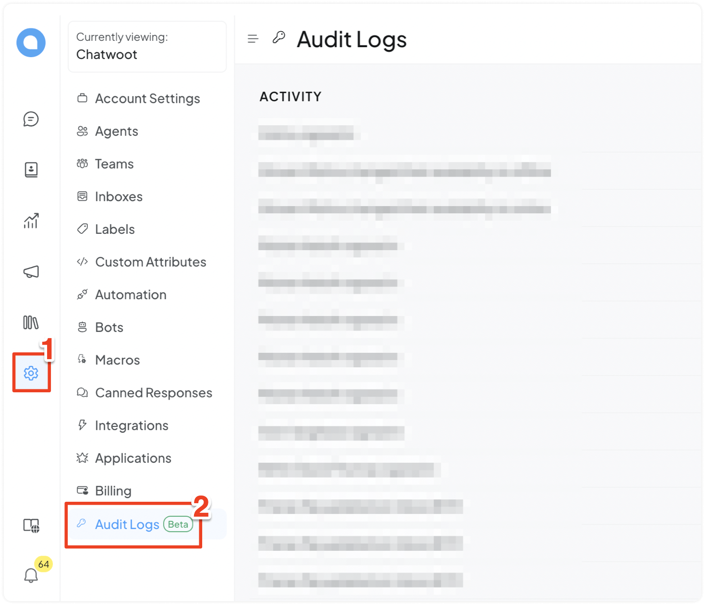
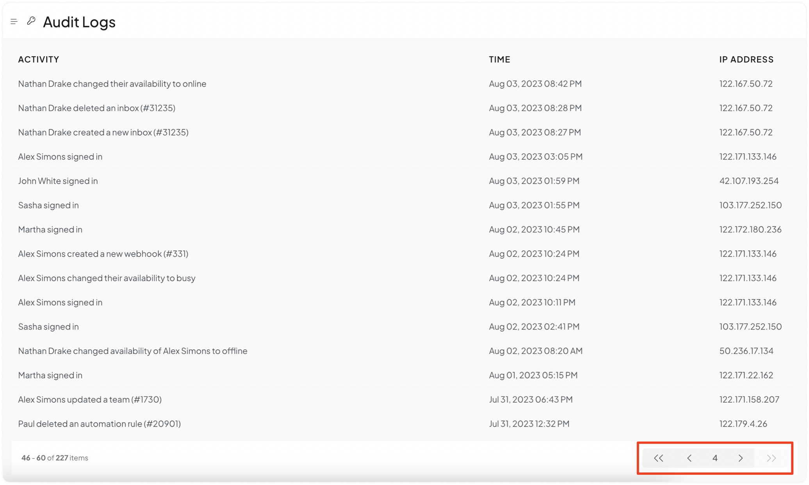

Audit Logs is an Enterprise feature. This keeps a record of the activities occurring in your account, which you can track to audit your account, team, or services. Essentially, audit logs answer the four W's for you:

- Who

- What

- When

- Where

Or, **who** did **what**, **when** and from **where**?

## Where to find the Audit Logs within Chatwoot?

**Step 1.** If the feature is available to you, you can find it by going to 'Settings' -> 'Audit Logs'.

**Step 2.** Browse through your logs. Scroll down to find your desired entries or use the navigation to switch pages.

Pro tip: Use `cmd/ctrl + F` to quickly search for a desired entry.

You will find the entries under three headers: Activity, Time and IP Address.

## Activities tracked through Audit Logs

Whenever any of the following activities occurs within your account, an entry is created along with the date and timestamp, and the IP address. See the full list below.

### User activity logs

- *Name | Email* Changing self status to online, offline, busy

- *Name | Email* signed in

- *Name | Email* signed out

- *Name | Email* changed the availability status of *Name | Email* to *online | offline | busy*

- *Name | Email* invited the user *email* as an *agent | admin*

- *Name | Email* changed the role of the user *email* to *agent | admin*

### Account activity logs

- *Name | Email* updated the account configuration.

### Automation rule logs

- *Name | Email* created a new automation rule (_#rule-id_)

- *Name | Email* updated an automation rule (#rule-id)

- *Name | Email* deleted an automation rule (#_rule-id_)

### Macro logs

- *Name | Email* created a new macro (#_macro-id_)

- *Name | Email* updated a macro (#_macro-id_)

- *Name | Email* deleted a macro (#_macro-id_)

### Inbox logs

- *Name | Email* created a new inbox (#_inbox-id_)

- *Name | Email* updated an inbox (#_inbox-id_)

- *Name | Email* deleted an inbox (#_inbox-id_)

- *Name | Email* added *Name1 | Email1*, *Name2 | Email 2* to the inbox (#_inbox-id_)

- *Name | Email* removed *Name1 | Email1*, *Name2 | Email 2* from the inbox (#_inbox-id_)

### Webhooks logs

- *Name | Email* created a new webhook (#_webook-id_)

- *Name | Email* updated a webhook (#_webhook-id_)

- *Name | Email* deleted a webhook (#_webhook-id_)

### Team logs

- *Name | Email* created a new team (#_team-id_)

- *Name | Email* updated a team (#_team-id_)

- *Name | Email* deleted a team (#_team-id_)

- *Name | Email* added *Name1 | Email1*, *Name2 | Email 2* to the team (#_team-id_)

- *Name | Email* remove *Name1 | Email1*, *Name2 | Email 2* from the team (#_team-id_)
