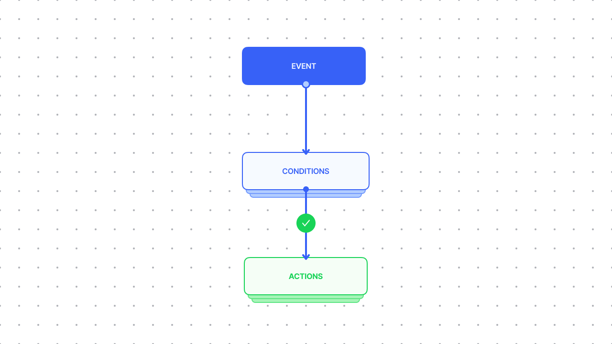
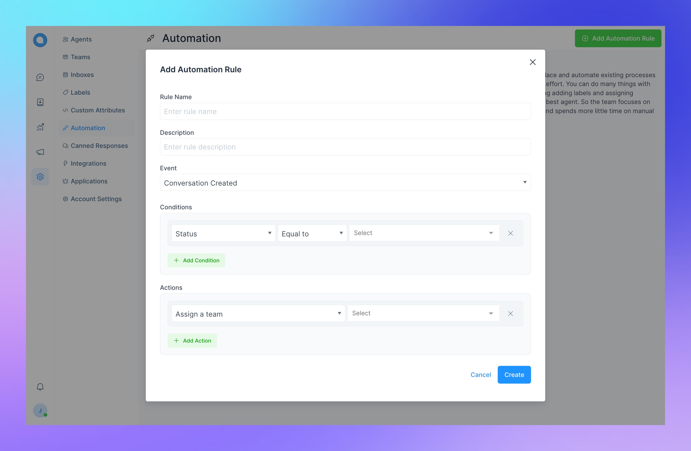
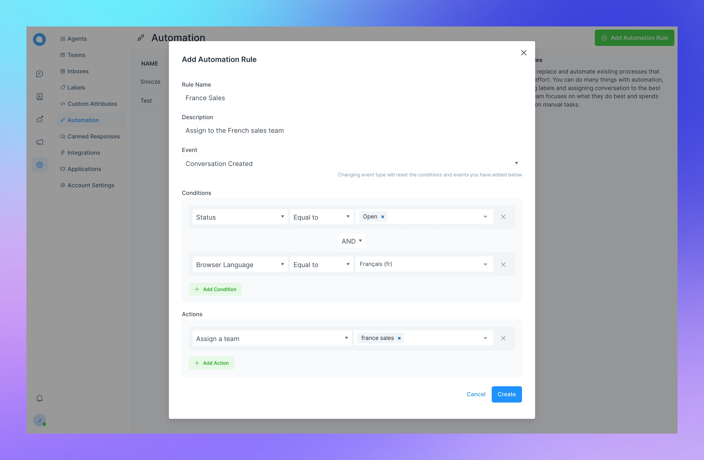
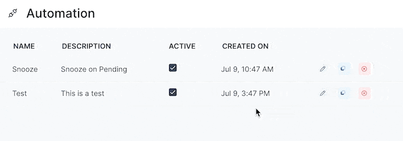

Chatwoot automations will help you streamline your teams workflows, they will allow you to automate processes, repetitive tasks and save your time. You can do many things with automations, including assigning labels, teams and assigning conversation to the best agent. So the team focuses on what they do best and spends more little time on manual tasks.

A chatwoot automation is made up of three things, an **Event**, **Conditions** and **Actions**. The Event is the trigger that will execute the respective automation rule. The Conditions are a list of criteria that will be checked before the action is executed. The Actions are a list of tasks that will be executed when the conditions are met.

## Automation Events

Automation Events are triggers on when you want your automation executed. Chatwoot currently supports three kinds of events.

1. Conversation created - this will trigger when a new conversation is created in your system. This will include conversations created by all channels.
2. Conversation updated - this will trigger when a conversation is updated.
3. Message created - this will be triggered when any new message inside a conversation is created.

## Automation Conditions

Conditions are a criteria that will be checked before the action is executed. The conditions are evaluated in the order they are defined.

| Conversation Created | Conversation Updated | Message Updated  |
| -------------------- | -------------------- | ---------------- |
| Conversation Status  | Conversation Status  | Message Type     |
| Browser Language     | Browser Language     | Message Contains |
| Country              | Country              |                  |
| Referrer Link        | Referrer Link        |                  |
|                      | Assignee             |                  |
|                      | Team                 |                  |

## Automation Actions

Actions are tasks/processes that are executed whenever respective conditions are met.

Chatwoot currently supports the following actions:

1. Assign conversation to a team.
2. Assign label to a conversation.
3. Send email to a team.

## Creating Automations

In order to create automation, you need to go to the Automations page, navigate there by clicking on the Settings icon on the Chatwoot sidebar and select `Automations`.

Click on the `+ Add Automation Rule` button open the Automation creation modal.

1. Give your automation a name.
2. Add a description (optional).
3. Select an event.
4. Add conditions.
5. Add actions.

You can chain multiple conditions with the `AND` or `OR` operator, like the below example.

Example - Assigning a conversation to a team when the Browser language is france and Status is Open, when a new conversation is created.

1. Add a name and a description
2. Select event as `Conversation Created`
3. Add two conditions and join them with the `AND` opeator, Condition 1 - `Conversation Status` as `Open` and Condition 2 - `Browser Language` as `Francais (fr)` from the dropdown.
4. Add an action - `Assign a team` and select the team `France sales` from the dropdown. (You need to create your team first)

## Editing Automations

To edit an automation, click on the `Edit` icon from the automations list you want to edit.

## Clone Automation

To make a copy of an exisitng automation, just click on the clone icon from the automations list you want to copy. This will create an exact replica of the automation with the same conditions and actions.

## Deleting Automations

To delete an automation, click on the delete button from the list, note that this is permanent and cannot be undone.
