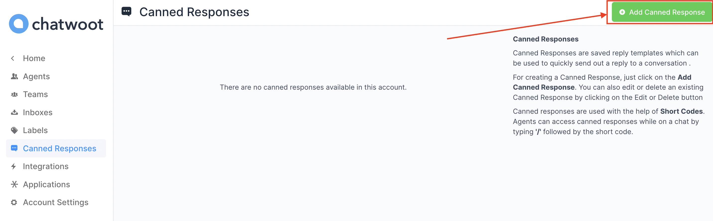

Canned Responses are saved reply templates that are used to send out a reply to a conversation quickly. You can use canned responses to save replies to frequently asked questions, which will help reduce an agent's response time and productivity. An agent can access canned responses while chatting by typing **`/`** followed by the shortcode.

### Use a canned response in a conversation

All canned responses are available for all agents in the account. To access canned responses while you chat with a customer, enter `/` followed by the shortcode in the text editor shown below, which will highlight the canned response with the shortcode. Then, press `Enter` key, and it will update the editor with the reply.

### Add a new canned response

Any agent/admin in the account can create/modify a canned response. To add a new canned response, navigate to the canned response settings by clicking on **Settings -> Canned Responses** from the sidebar. By default, there are no canned responses available in the account.

Click on **Add Canned Response** button available on the top right corner of the page, which will open a modal as shown below.

The fields shown in the modal are described below.

| Field Name | Description |
| -- | -- |
| Short Code | Enter a short code - minimum length of 2 characters. Shortcode is unique. You cannot create a canned response with the same shortcode twice in the account. |
| Content | Type in the message you want to send when the shortcode is entered on the chat. |

Once you enter the details, click on the **Submit** button. If the request is successful, a message "Canned Response added successfully" will be displayed.

**Note**: Canned responses are created by an agent is available to all agents/administrators in the account.

### Modify a canned response

To **update a canned response**, open the canned response list from **Settings -> Canned Responses**. All canned responses in your account will be available there. Click on the edit button as shown below, which will open a modal with prefilled information. You can edit both the shortcode and the message. Click on **Submit** to save the changes. Click on **Cancel** if you want to discard the changes.

  

To **delete a canned response**, click on the delete button as shown below. A confirmation modal will be displayed. Click on **Yes, delete** to continue with the deletion.

**Note**: The canned response supports the template variables. See [this guide](/docs/user-guide/features/template-variables) to learn more about adding template variables.
