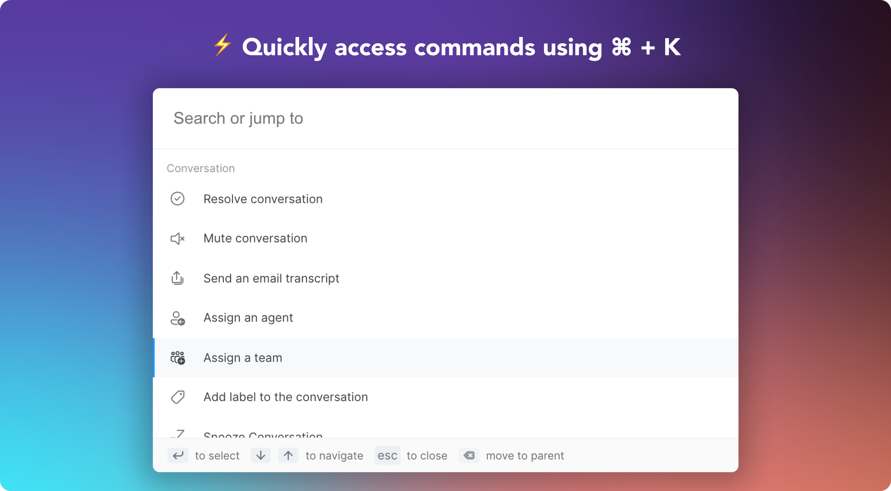

Chatwoots command bar will help you navigate more seamlessly around Chatwoot dashboard and optimize you workflow with a new host of commands starting with a single shortcut - `⌘ + K` on macOS and `Ctrl + k` on Windows and Linux from anywhere in the Chatwoot dashboard. You can quick navigate to Reports, Settings etc. You can also execute time savings actions on conversations like Resolve, Snooze, Email transcript, assign agent etc, without moving from the keyboard.

## Opening the command bar

Open the command using one of the following keyboard shortcuts:

- Windows and Linux: `Ctl k`
- Mac: `Cmd k`

## Fast Navigation

With the command bar, you can quickly navigate to Reports, Settings, and more. You can simply start searching for the page you want to navigate and press enter to go there.

#### <u>Quick navigations available</u>

- Dashboard Home
- Contacts
- Reports
  - Agent Repotrts
  - Label Reports
  - Inbox Reports
  - Team Reports
- Settings
  - Agent Settings
  - Team Settings
  - Label Settings
  - Canned Response Settings
  - Application Settings
  - Account Settings
  - Profile Settings
- Notifications

## Conversation Actions

The commandbar is **aware** of where you are in the Chatwoot dashboard and it intelligently suggests you commands that help you be more productive and fast. You can execute actions on conversations like Resolve, Snooze, Email transcript, assign agent etc, without moving from the keyboard.

The commands suggested will also be aware of the conversation status. For example, if a conversation is closed, it will suggest you to reopen it.

#### <u>Commands available</u>

- Resolve/Reopen the conversation
- Mute/Unmute conversation
- Send an email transcript
- Assign conversation to an agent
- Assign conversation to a team
- Add label to the converation
- Snooze the conversation

#### <u>Assigning an agent</u>
1. Open the command bar
2. Search for Assign agent and press enter
3. Select the agent you want to assign the conversation to.

Similarly you can also assign a team, label to the conversation.
