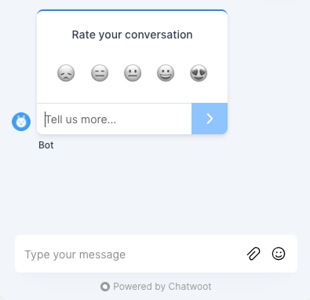
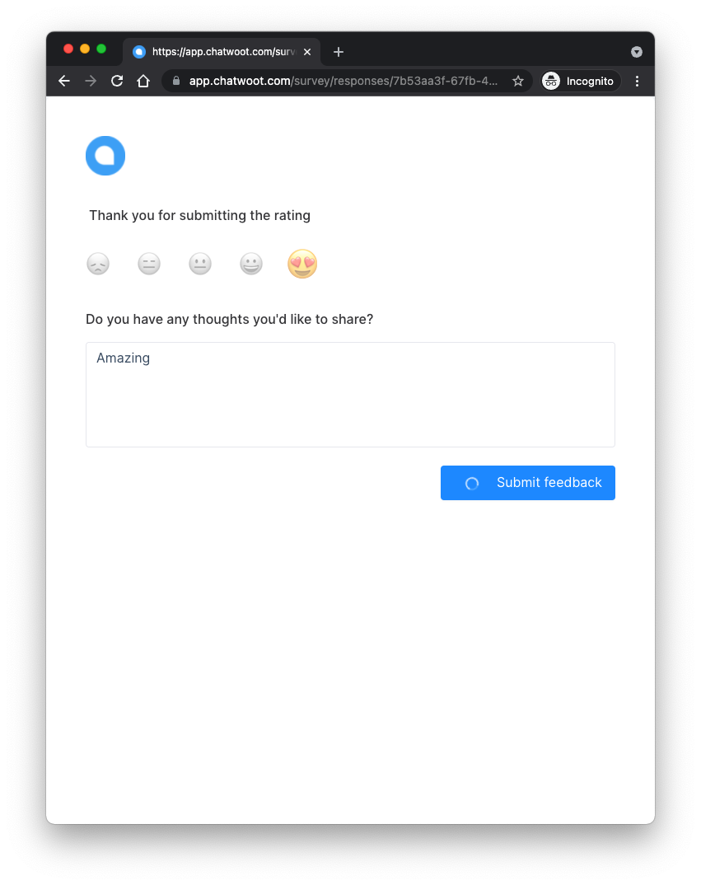
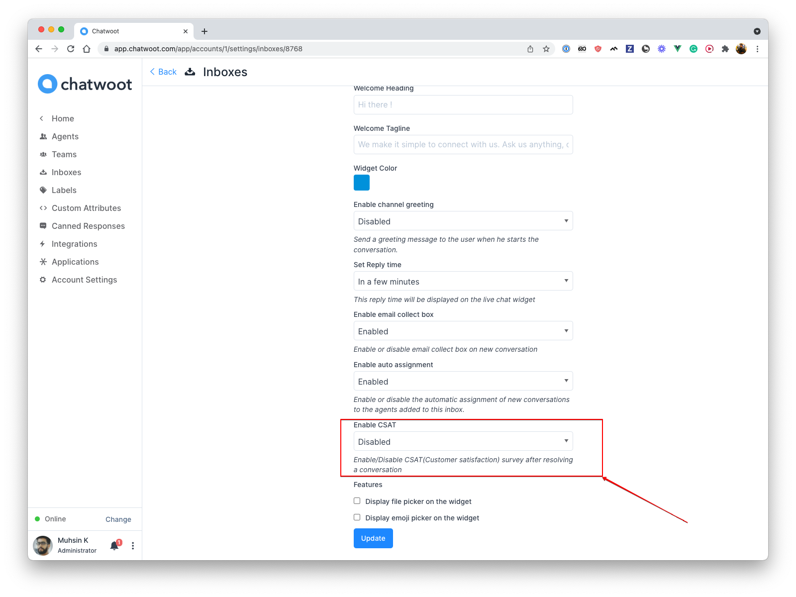

The CSAT(Customer satisfaction score) generally represents how happy customers are with your product or service or specific experience. CSAT is one of the critical customer satisfaction metrics in Chatwoot that any customer-facing business should monitor. When an agent resolves the conversation, Chatwoot sends a survey to your customers for rating and feedback.

It's calculated by asking a question, such as "Rate your conversation" There's a corresponding survey emoji scale. After submitting the rating, the customer can give more feedback which is optional.

#### CSAT in website inbox

#### CSAT in non-website inbox

### Enable CSAT

To enable/disable CSAT, navigate to the inbox settings (CSAT is disabled default)

### How to analyze CSAT

You can view a [report](/user-guide/reports#csat) of your conversation ratings to monitor your support team’s performance, as well

