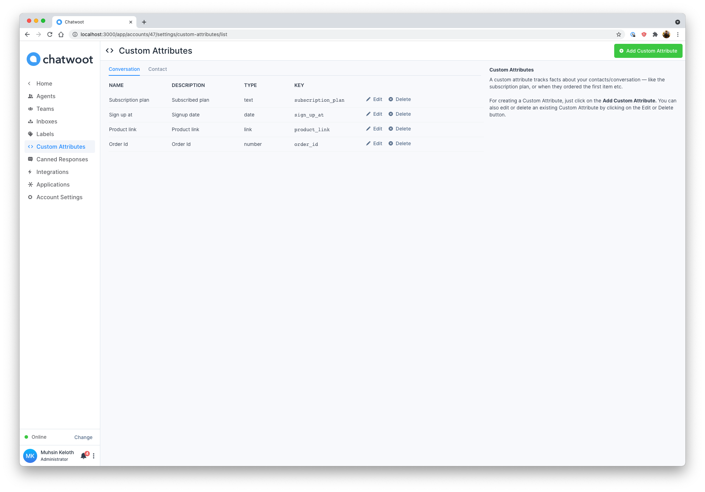
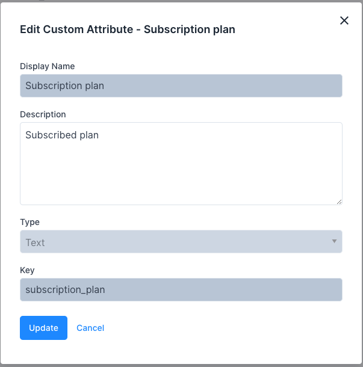

A custom attribute tracks facts about your contacts/conversation. The attribute can be anything, For eg:

- Subscription plan
- Signup date
- Number of users added
- First ordered item
- Most ordered item

This Custom Attributes can be accessed from the Settings  menu under the menu item, Custom Attributes. 

These are the inputs required to create the custom attribute:

| Input        | Description
--------------------------------------------------------------------------------------------------------------------- | ---------------------------------------------------------------------------------------------- |
| Applies to | Conversation/Contact
| Display name | Custom attribute display name
| Description | Custom attribute description
| Type | Text, Number, Link and Date
| Key | 

