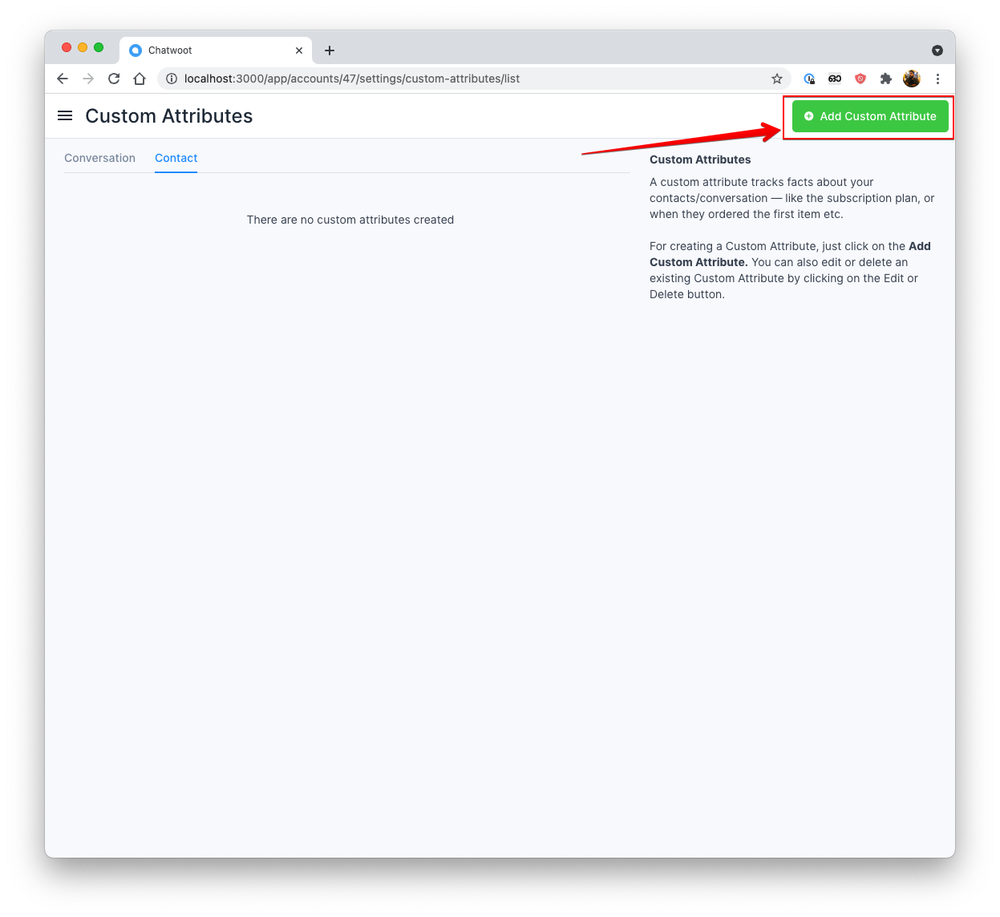
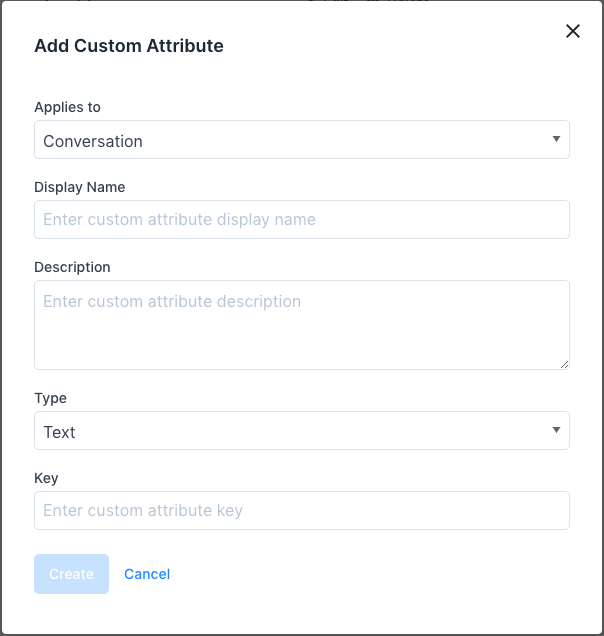
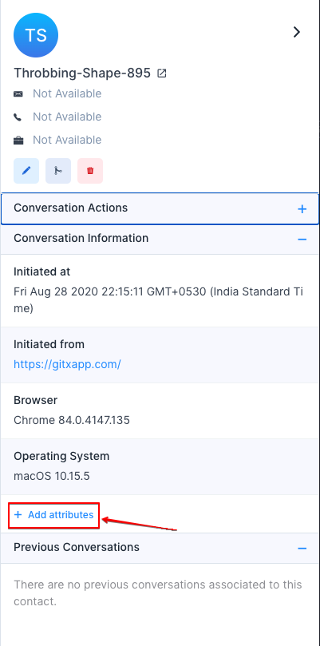
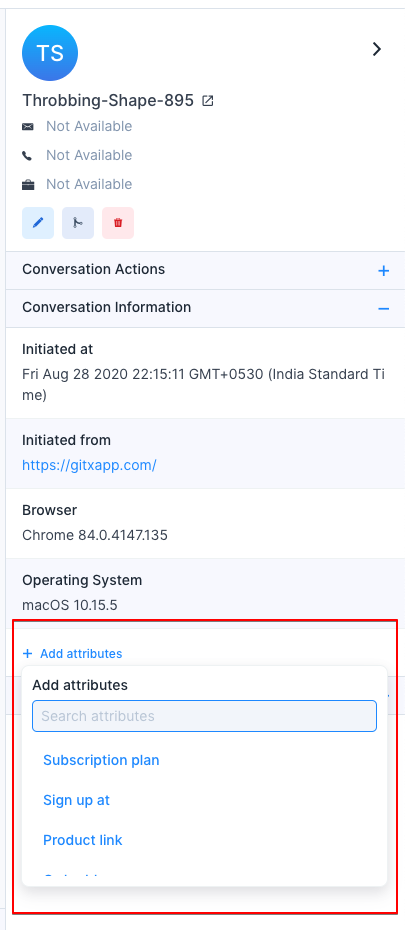
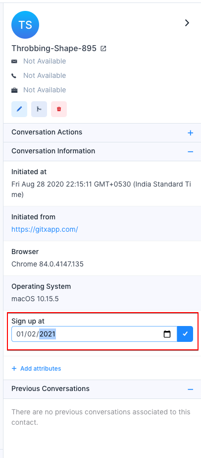
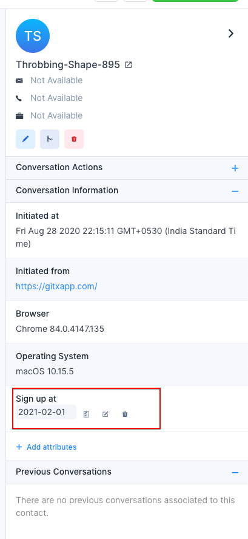
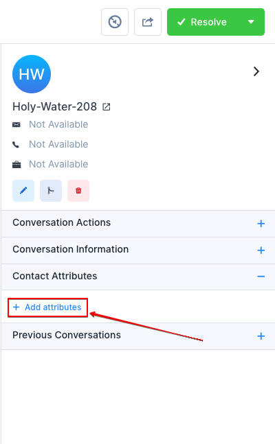
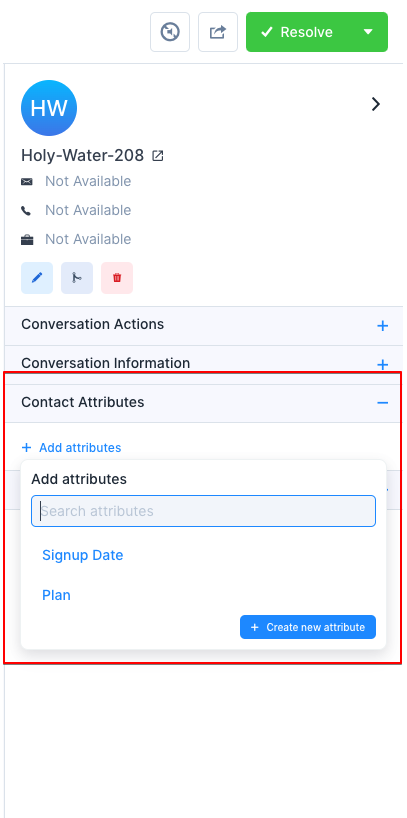
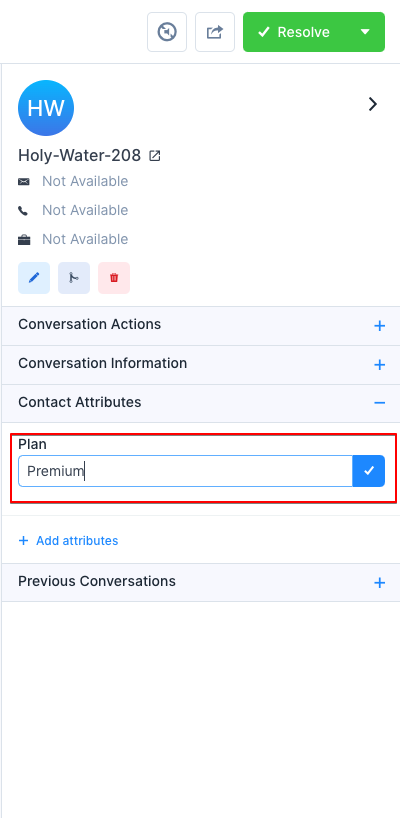
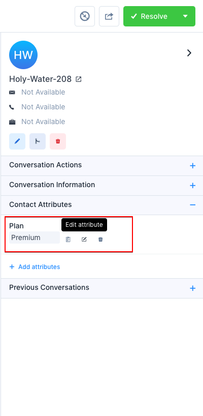

Chatwoot supports custom attributes other than standard data attributes (a default set of data about your conversations/contacts like Name, Email, Location, etc.). A custom attribute tracks facts about your contacts/conversations. The custom attribute can be anything, E.g.:

- Subscription plan
- Subscribed date
- Signup date
- Most ordered item
- Ordered product link
- Last transaction date

> The only difference between custom and standard attributes is standard data attributes automatically get updated.

Custom data attributes are the information you attached to conversation/customers, like how many times they've ordered a product, when they signup, or what plan they're on. So you can set whatever attributes you want to understand your customer/conversation better, and it will all show in Chatwoot.

### Add a new custom attribute

To add a new custom attribute, navigate to the Custom Attributes by clicking on **Settings -> Custom Attributes** from the sidebar.



Click on **Add custom attributes** button available on the top right corner of the page, which will open a modal as shown below.



These are the inputs required to create the custom attribute:

<div class="table table-striped">

| Input        | Description                                                                 |
| ------------ | --------------------------------------------------------------------------- |
| Applies to   | Attribute type (Conversation/Contact)                                       |
| Display name | Act as a label while rendering custom attribute                             |
| Description  | Description about the custom attribute                                      |
| Type         | Type of data it will store. Currently supports Text, Number, Link, and Date |
| Key          | Unique identifier attach to the custom attribute                            |

</div>

> You cannot create a custom attribute with the same key twice in the account.

Once you enter the details, click on the **Create** button. If the request is successful, a message "Custom attribute added successfully" will be displayed.

### Conversation custom attributes

#### 1. Set attributes via SDK method

You can set custom attributes for each conversation using the SDK using the `setConversationCustomAttributes` method, and also delete the attribute using the `deleteConversationCustomAttribute` method, you can read more about setting conversation attributes [here](/product/channels/live-chat/sdk/setup/#for-a-conversation)

#### 2. Set attributes via contact side panel

After creating conversation custom attribute, you will be able to add these attribute to the conversation via conversation sidebar.



It will open a attribute dropdown selector, then select the attribute that you want to add



Enter a valid value click on the Create button. If the request is successful, a message "Attribute added successfully" will be displayed.



Also you could able see the actions like edit/delete/copy by hovering on the attribute.



### Contact custom attributes

There two ways for setting custom attributes for contacts

#### 1. Set attributes via SDK method

To set a contact custom attributes call `setCustomAttributes` method as follows,

```js
window.$chatwoot.setCustomAttributes({
  key: value,
  // Key is a unique identifier which is already defined while creating a custom attribute
  // Value should be based on type (Currently support Number, Date, String and Number)
  // Double-check that your keys always have a JSON-valid value
  // You need to flatten nested JSON structure while using this function
});
```

Ex:

```js
window.$chatwoot.setCustomAttributes({
  plan: "premium",
  signUpDate: new Date(),
});
```

You can view these attributes in the contact side panel

To delete a custom attribute, use `deleteCustomAttribute` as follows

```js
window.$chatwoot.deleteCustomAttribute("attribute-key");
```

Ex:

```js
window.$chatwoot.deleteCustomAttribute("signUpDate");
```

> Prior to version v1.22 , all the attributes rendered as text. Please create new definition to display the value properly

#### 2. Set attributes via contact side panel

After creating contact custom attribute, you will be able to add these attribute to the contact via conversation/contact sidebar.



It will open a attribute dropdown selector, then select the attribute that you want to add



Enter a valid value, click on the Create button. If the request is successful, a message "Attribute added successfully" will be displayed.



Also you could able see the actions like edit/delete/copy by hovering on the attribute.


