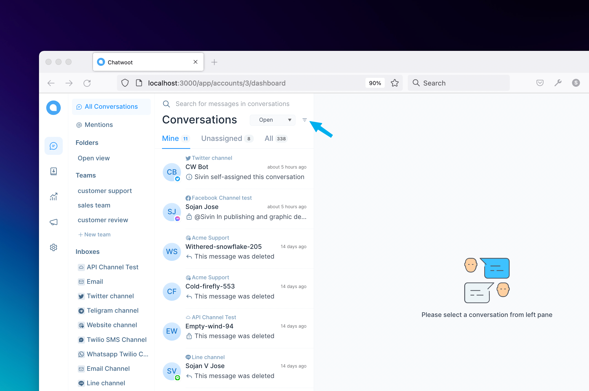
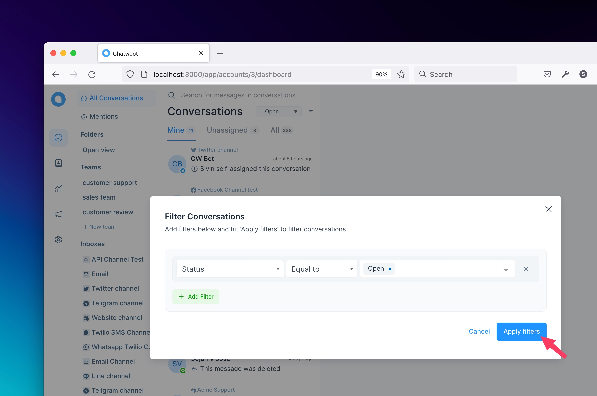
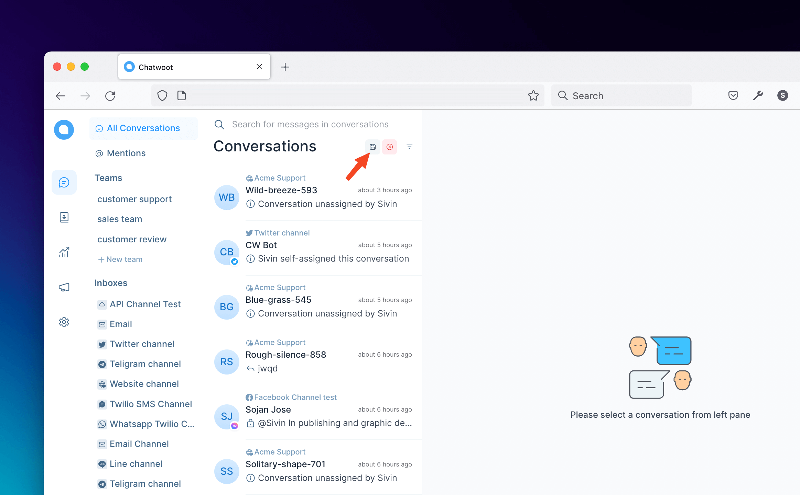
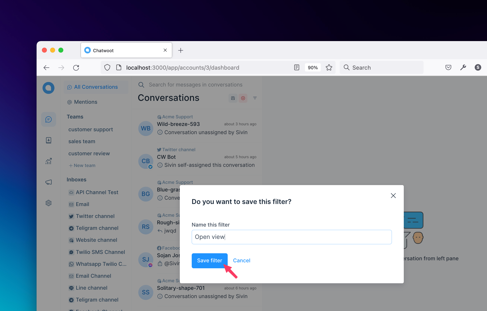
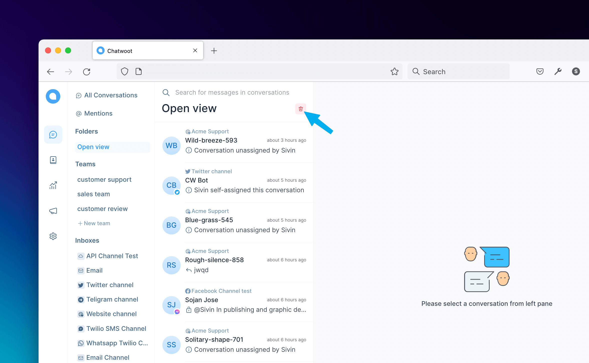
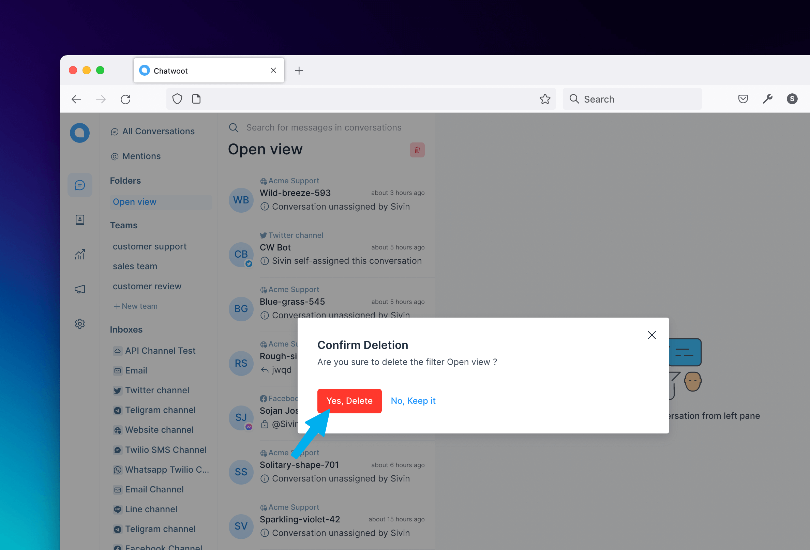

Chatwoot lets users sort and filter conversations based on different categories by using advanced filters. And now we can save them as folders and will be displayed in the secondary sidebar as folders. This feature will help users to custom save different conversations on users views.

You can simply click on the filter icon at top of the conversation list panel.

Now you can see the filters popup, which lets you select the filter type, the operator (equal to, not equal to, present, not present) and the value.

### Save a new folder

After applying the filter it will fetch all conversations based on given values. And now you can see the **save icon** at top of the conversation list panel and click the save button, as in bellow attached image.

Now you can see a modal popup, ask **Do you want to save this filter?**. Give a name for the filter and click the **save filter** button, it will save the filter and open the folder that you have saved last.

### Select a saved folder

And now the folder name that you have given above will **display** in the secondary sidebar as in the bellow image, by clicking the **folder** it will fetch all the conversations that you saved above.

### Delete a saved folder

If you want to **delete** the saved folder you can delete it, by clicking the **bin icon** at top of the conversation list panel will open a modal.

Now you see a modal that shows **Confirm Deletion** if you click **No, Keep it**, will close the modal go back to folder view or if you click **Yes, Delete**, will delete the view. After deleting, If the folder is empty it will go back to all conversations or filtered views or if the folder has length then it will open the next folder near the deleted one.

