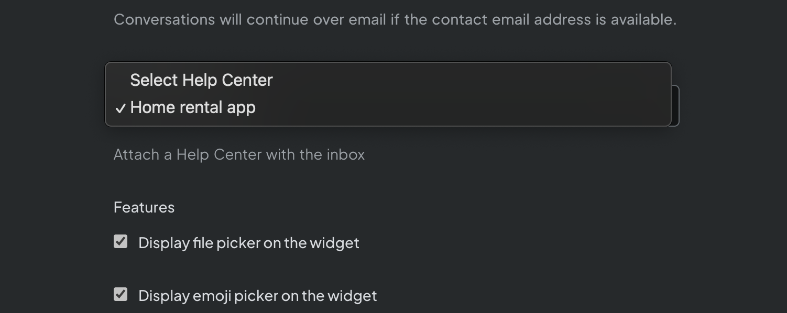
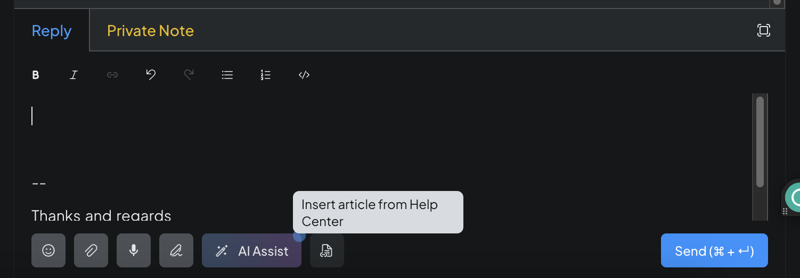
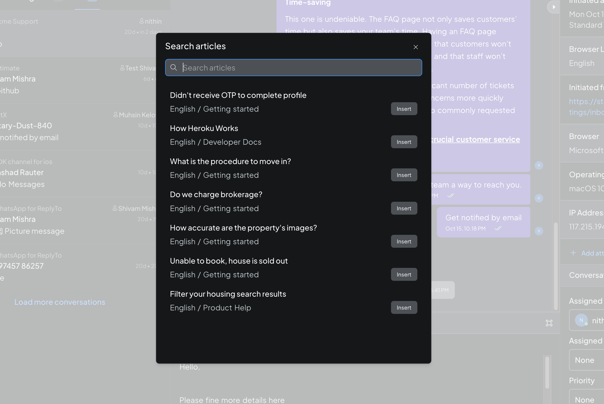
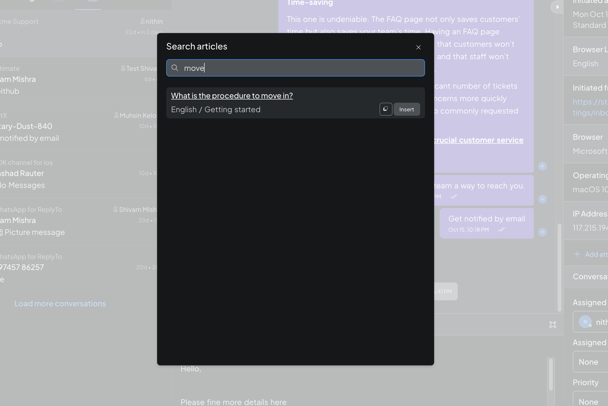
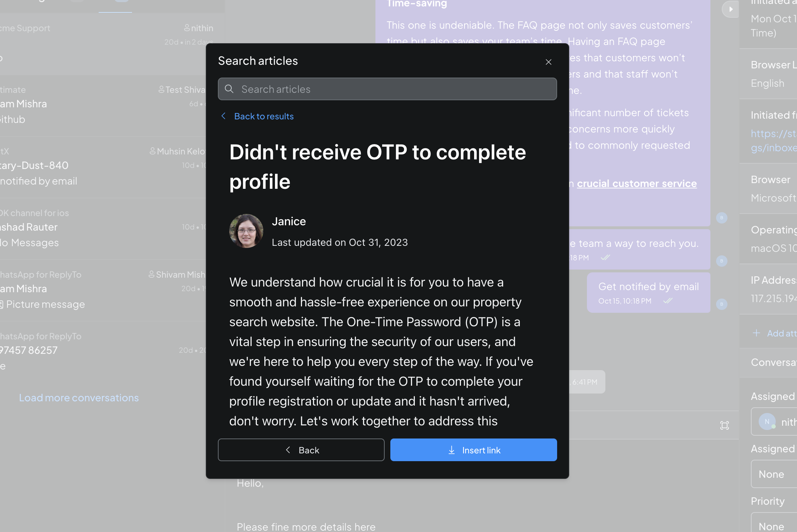

First, navigate to the portal settings and scroll down to the bottom of the settings tab. You'll find a selection input for the help center that includes all portals in your account. Select the portal you wish to integrate with the inbox. Once this is done, proceed to the conversations page.

Note: At a time only one portal can be connected to the inbox. Articles from the same portal will be shown in the widget under popular articles.

In the reply editor, you'll find the "Insert Article" button at the bottom panel (next to the AI assist/signature button).

Clicking this button will open a modal allowing you to search for articles. By default, the modal will display popular articles.

As you search for articles, the results will appear.

Clicking on a title in the search results will open an article preview within the modal. You can insert the article's link directly into the reply box by clicking the "Insert" button. The icon next to the insert button allows you to copy the article's link.

Finally, click the "Insert Link" button to add articles to your response.

