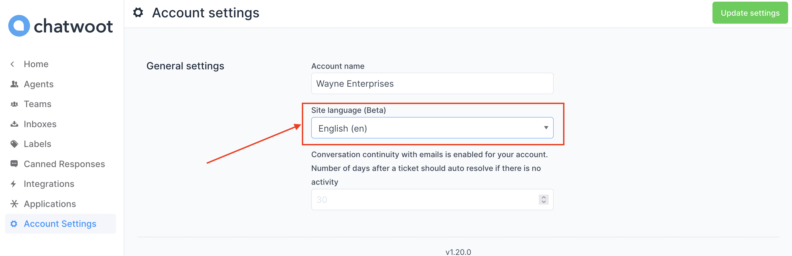

Chatwoot natively supports 25+ different languages. The section below describes how you can configure the Chatwoot dashboard and live-chat widget to work with different languages.


### Supported languages

This table shows the languages supported in Chatwoot and the corresponding shortcodes (derived from [ISO 639 language codes](https://en.wikipedia.org/wiki/List_of_ISO_639-1_codes)).

| Language | Short Code |
| -- | -- |
| English (en) | en |
| العربية (ar) | ar |
| Nederlands (nl) | nl |
| Français (fr) | fr |
| Deutsch (de) | de |
| हिन्दी (hi) | hi |
| Italiano (it) | it |
| 日本語 (ja) | ja |
| 한국어 (ko) | ko |
| Português (pt) | pt |
| русский (ru) | ru |
| 中文 (zh) | zh |
| Español (es) | es |
| മലയാളം (ml) | ml |
| Català (ca) | ca |
| ελληνικά (el) | el |
| Português Brasileiro (pt-BR) | pt_BR |
| Română (ro) | ro |
| தமிழ் (ta) | ta |
| فارسی (fa) | fa |
| 中文 (台湾) (zh-TW) | zh_TW |
| Tiếng Việt (vi) | vi |
| dansk (da) | da |
| Türkçe (tr) | tr |
| čeština (cs) | cs |
| suomi, suomen kieli (fi) | fi |
| Bahasa Indonesia (id) | id |
| Svenska (sv) | sv |
| magyar nyelv (hu) | hu |
| norsk (no) | no |
| 中文 (zh-CN) | zh_CN |
| język polski (pl) | pl |

### Update language in the live-chat widget

As described in the [SDK setup guide](/docs/product/channels/live-chat/sdk/setup), you can configure the locale in the live-chat widget either by passing it in the `chatwootSettings` or by calling the `setLocale` method. Provide the shortcodes available in the table above in these methods.


```js
// Pass via window.chatwootSettings
window.chatwootSettings = {
  locale: 'pt_BR',
  // .. rest of the settings
}

// Using setLocale method
window.$chatwoot.setLocale('pt_BR')
```

### Update language in the dashboard

To update the language in the dashboard, log in as an administrator. Click on the **Settings**, navigate to **Account Settings**. You will be able to see the **Site Language** setting available in the options. Change it to the language of your choice. Click on the **Update Settings** button.



**Note:** Changing the language as per the above instruction would change the default language for all agents/administrators in the system. At the moment, Chatwoot does not support language selection at the agent level. Also, note that this language would be used as the fallback language for the live-chat widget.
