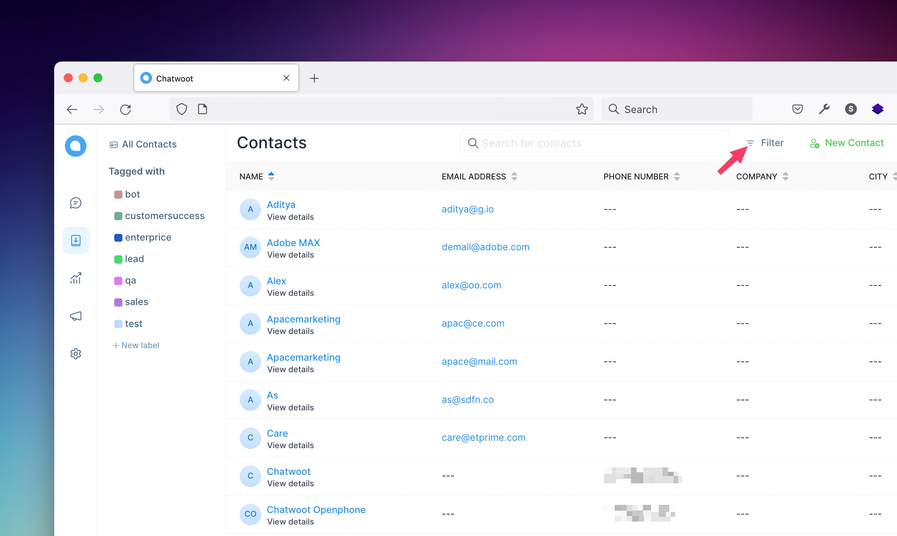
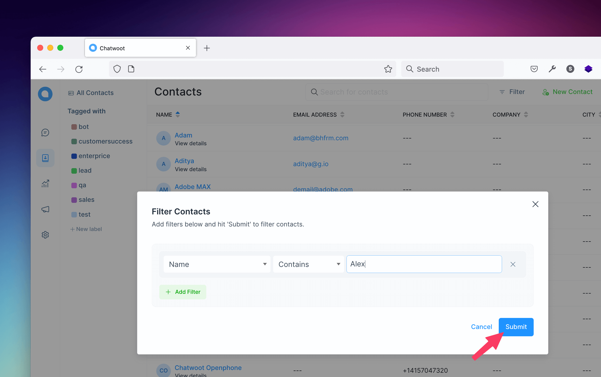
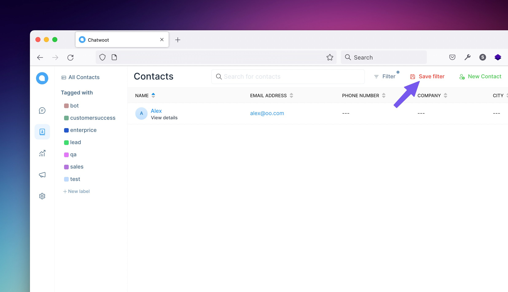
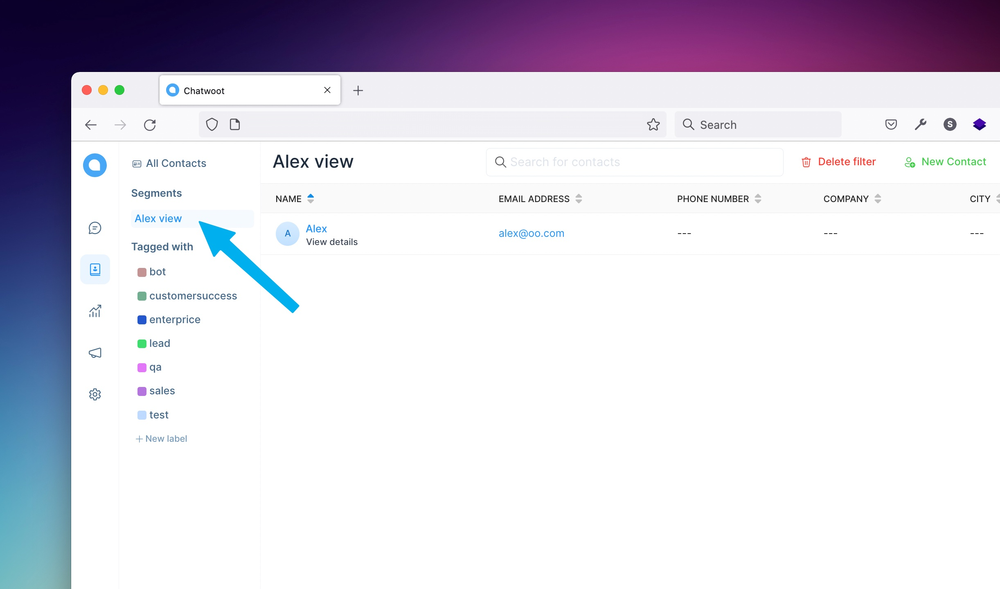
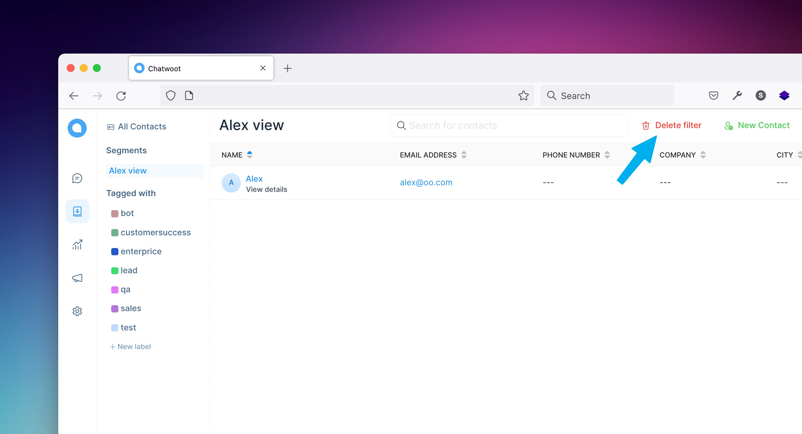
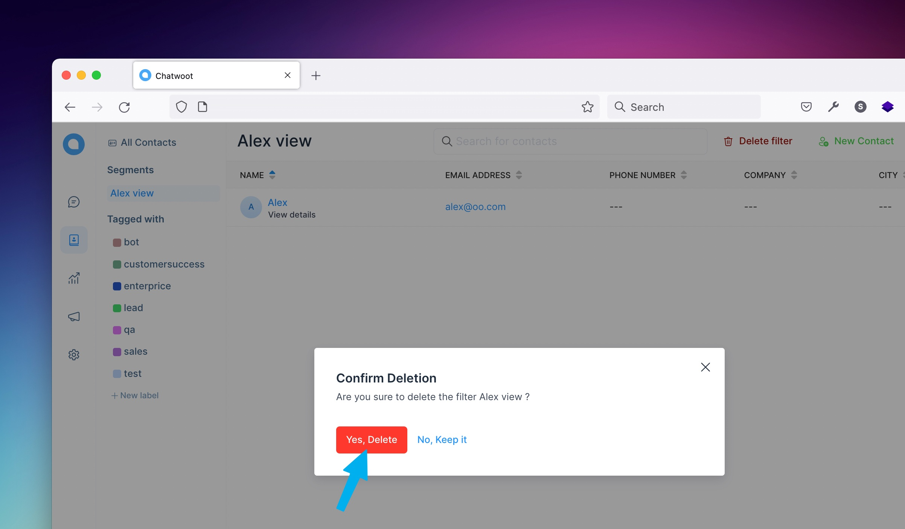

Chatwoot lets users sort and filter contacts based on different categories by using advanced filters. And now we can save them as segments and will be displayed in the secondary sidebar under the segments section. This feature will help users to custom save different contacts on users views.

You can simply click on the filter button in the header of the contact page.

Now you can see the filters popup, which lets you select the filter type, the operator (equal to, not equal to, contains, does not contains) and the value.

### Save a new segment

After applying the filter it will fetch all contacts based on given values. And now you can see the **save filter** button in the header of the contact page and click the save filter button, as in bellow attached image.

Now you can see a modal popup, ask **Do you want to save this filter?**. Give a name for the filter and click the **save filter** button, it will save the filter and open the segment that you have saved last.

### Select a saved segment

And now the segment name that you have given above will **display** in the secondary sidebar as in the bellow image, by clicking the **segment** it will fetch all the contacts that you have saved above.

### Delete a saved segment

If you want to **delete** the saved segment you can delete it, by clicking the **delete filter** button in the header of the contact page will open a modal.

Now you see a modal that shows **Confirm Deletion** if you click **No, Keep it**, will close the modal go back to segment view or if you click **Yes, Delete**, will delete the segment. After deleting, if the folder is empty it will go back to all contacts or filtered views or if the segment has length then it will open the next segment near the deleted one.

