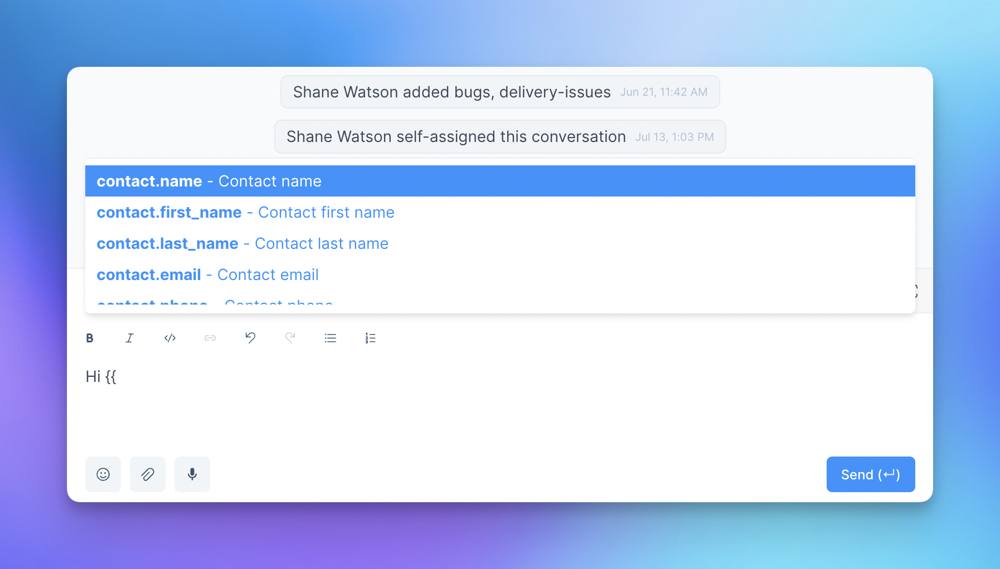
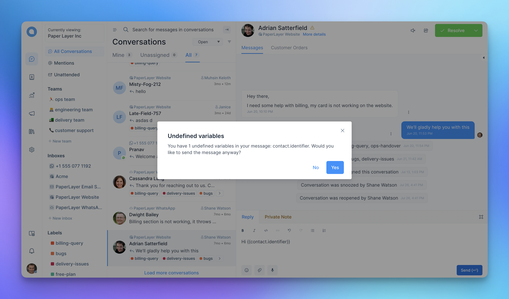

Variables are placeholder text in messages that are dynamically replaced based on the information you've provided.

When you create a message with variables, Chatwoot will translate it to the appropriate value.

If we send a message `Hey {{ contact.name }}, how may I help you?`, then Chatwoot will pick the contact name and send a message like `Hey John, how may I help you?`. This enables you to send personalized messages to the end user.

> Note: Chatwoot supports variables in canned response/macros/automation.

To use a variable, type two double curly brackets **`{{`** when composing a new message or creating a canned response. The variables will appear, and you can select the one you'd like to use.

The current list of template variables are:

| Variable          | Description                                                           |
| ----------------- | --------------------------------------------------------------------- |
| conversation.id | Numeric version of the conversation id |
| contact.id | Numeric version of the contact id |
| contact.name | Contact full name |
| contact.first_name | Contact first name |
| contact.last_name | Contact last name |
| contact.phone_number | Contact phone number |
| agent.name | Agent full name |
| agent.first_name | Agent first name |
| agent.last_name | Agent last name |
| agent.phone_number | Agent phone number |

**What if the variable doesn't exist?**

If you try to send an undefined variable, then Chatwoot will show a warning.

**How to add fallback text?**

When defining a fallback text, make sure you surround it with single quotes.

`{{ contact.first_name || 'there'}}`