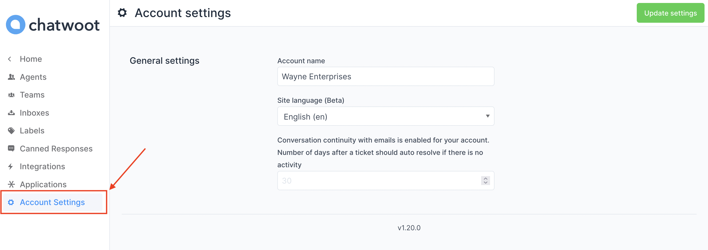

An account in Chatwoot holds the information about the organization. You can update the name or language used in the account by changing the settings as show below.

To update account details, click on Settings -> Account Settings. The available settings are shown below.

| Field Name | Description |
| -- | -- |
| Account Name | Enter the name of your Account. eg: Hopkins Inc |
| Site Language | Select the language in which conversations need to happen. eg: English (en) Select English if you want your  conversations to be in English |
| Number of days after a ticket should  auto resolve if there is no activity | Give the number of days after which the  ticket or conversation will be marked as  resolved  eg: 30 - This is given in case the customer  does not have any further queries but has not given closure also.  |

Click on Update Settings Button on the right hand top side of the screen. 'Successfully updated account settings' message will be displayed.
