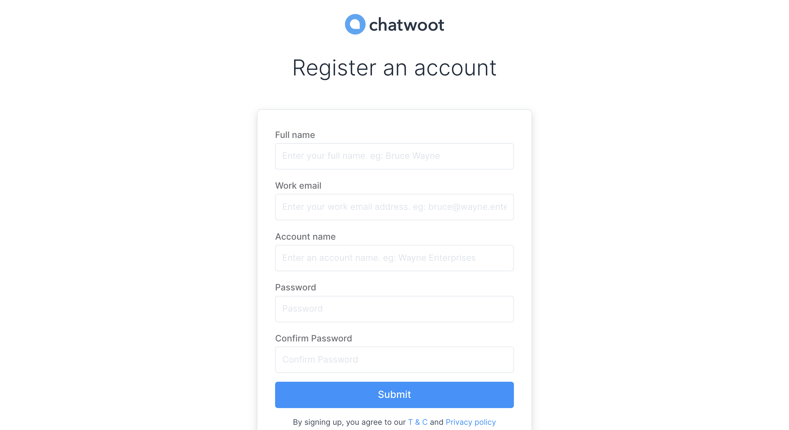
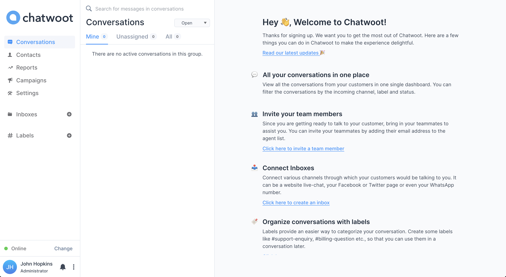

This guide will help you to create an account at Chatwoot cloud or any self-hosted Chatwoot installations.

If you are using a self-hosted Chatwoot installation, you may directly open the URL `{your_installation_url}/app/auth/signup.`

If you want to use Chatwoot cloud, you may open www.chatwoot.com and click on the "Create an account" button. This button takes you to the signup page.

You will be able to see a signup page as shown below.

The fields required to signup are as shown below.

| Field Name |  Description |
| -- | -- |
| Full Name | Enter Your Full name eg: John Hopkins |
| Work email | Enter a valid work e-mail address eg: *john.hopkins@companyname.com*  |
| Account name | Enter the name of your company eg: Wayne Enterprises |
| Password  | Password must contain at least one uppercase character (A-Z), at least one number character (0..9), at least one special character (!@#$%^&*()_+-=[]{}\|'"/\^.,`<\>:;?~) |
| Confirm Password | Confirm password should match with the password given above |

After signing up, you would be automatically logged into the dashboard. To complete the signup, you need to verify your email address. You will receive an email with the subject **Confirmation Instructions** from Chatwoot, as shown below.

Click on **Confirm my account** button.

Voila! You have verified your account at Chatwoot. Follow the steps below to set up your account so that you can be productive using Chatwoot.

- [Configure your profile](/docs/user-guide/setup-your-account/configure-your-profile)
- [Configure account details](/docs/user-guide/setup-your-account/configure-account-details)
- [Add Agent](/docs/user-guide/add-agent-settings)
- [Add Inbox](/docs/user-guide/add-inbox-settings)
- [Add Widget](/docs/user-guide/setting-up-chatwootwidget)
- [Add Teams](/docs/user-guide/add-teams-settings)
- [Add Labels](/docs/user-guide/add-label-settings)
- [Add Canned Responses](/docs/user-guide/features/canned-responses)
- [Integrations](/docs/user-guide/integrations)
- [Applications](/docs/user-guide/applications)
