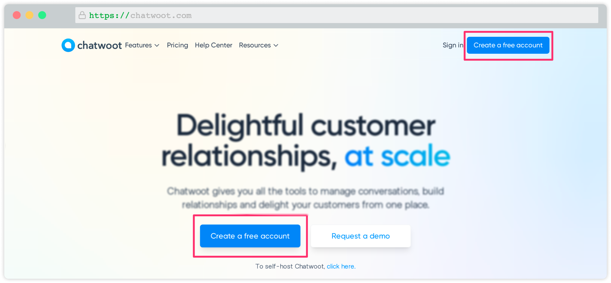
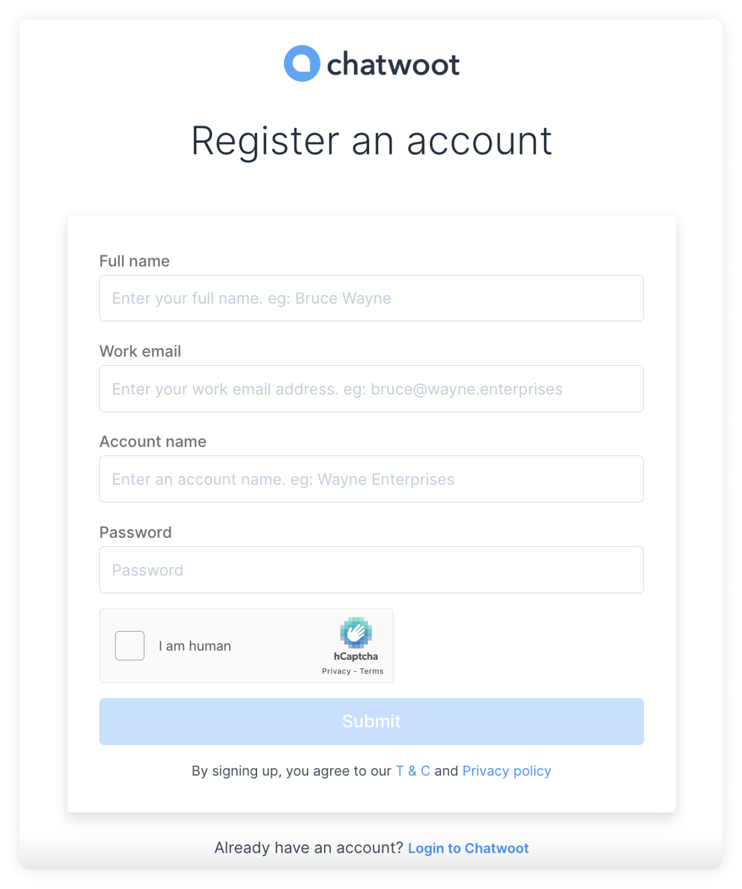
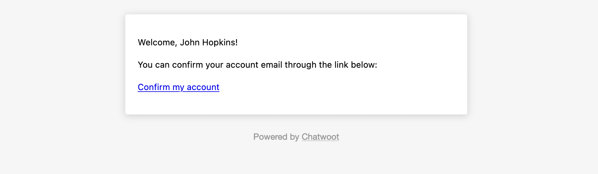
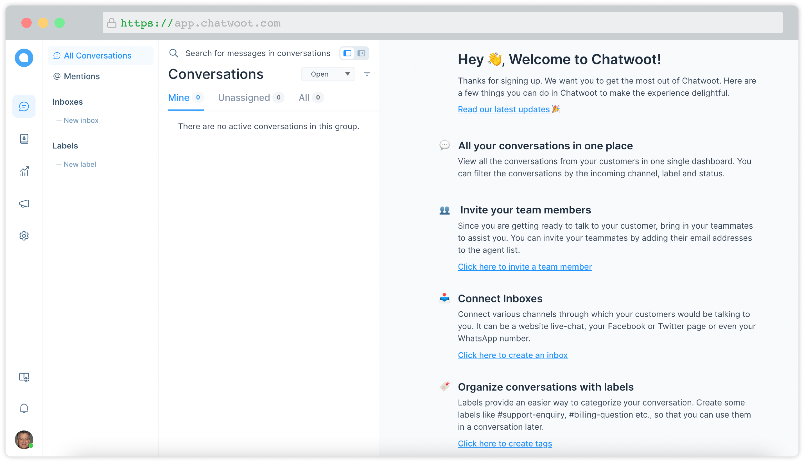

This guide will help you create your account on Chatwoot cloud or any of the self-hosted Chatwoot installations.

### I am using the self-hosted version

If you are using a self-hosted Chatwoot installation, you may directly open the URL `{your_installation_url}/app/auth/signup.`

P.S. We have a wholly different [guide](https://www.chatwoot.com/docs/self-hosted) for self-hosted Chatwoot.

### I am using the cloud version

**Step 1**. If you want to use Chatwoot cloud, you may open [chatwoot.com](https://chatwoot.com) and click on the "Create a free account" button. This button takes you to the signup page.

**Step 2**. You will be able to see a signup page as shown below.

The fields required to signup are as shown below. Fill up the fields.

| Field Name |  Description |
| -- | -- |
| Full Name | Enter Your Full name eg: John Hopkins |
| Work email | Enter a valid work e-mail address eg: *john.hopkins@companyname.com*  |
| Account name | Enter the name of your company eg: Wayne Enterprises |
| Password  | Password must contain at least one uppercase character (A-Z), at least one numeric character (0..9), and at least one special character `(!@#$%^&*()_+-=[]{}\|'"/\^.,`<\>:;?~)` |
| Confirm Password | Confirm password should match with the password given above |

**Step 3**. After signing up, you would be automatically logged into the dashboard. To complete the signup, you need to verify your email address. You will receive an email with the subject **Confirmation Instructions** from Chatwoot, as shown below.

**Step 4**. Click on the **Confirm my account** button.

Voila! You have verified your account at Chatwoot. 

### Next steps

Follow the steps below to set up your account and get the full power of Chatwoot.

- [Configure your profile](/docs/user-guide/setup-your-account/configure-your-profile): Set your name, picture, password, and more.
- [Configure account details](/docs/user-guide/setup-your-account/configure-account-details): Setup your account’s name, language, etc.
- [Add Agents](/docs/user-guide/add-agent-settings): Add your team members to your account to help with managing conversations.
- [Add Inboxes](/docs/user-guide/add-inbox-settings): Add your conversation inboxes/channels like website widget, Facebook, WhatsApp, etc. 
- [Configure your chat widget](/docs/user-guide/setting-up-chatwootwidget): Personalize your website chat widget. 
- [Add Teams](/docs/user-guide/add-teams-settings): Setup your teams like Sales, Services, Product, etc.
- [Add Labels](/docs/user-guide/add-label-settings): Setup labels for categorizing your contacts/conversations.
- [Add Canned Responses](/docs/user-guide/features/canned-responses): Create your saved reply templates for frequently asked questions.
- [Integrations](/docs/user-guide/integrations): Integrate Chatwoot with your favourite apps, or use Webhooks.
- [Applications](/docs/user-guide/applications): Connect your account with applications for better workflows.
