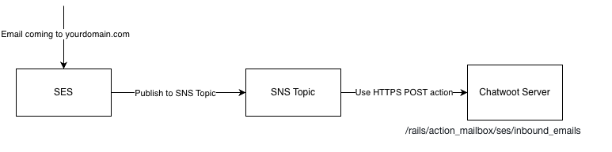
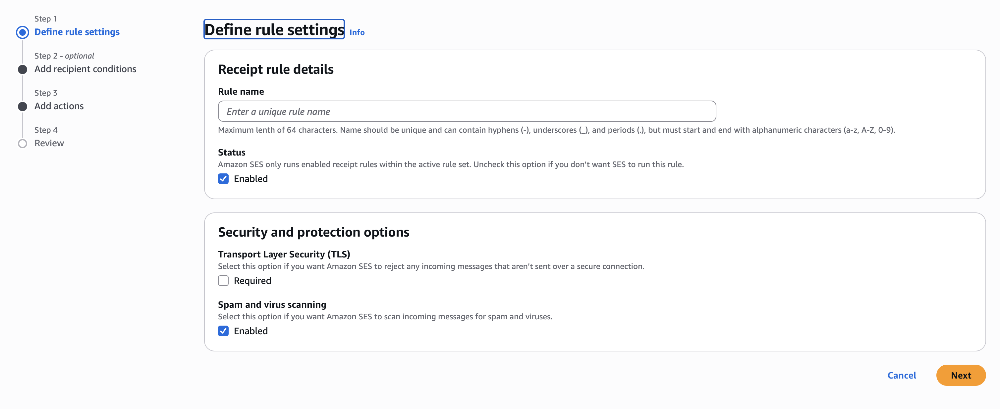
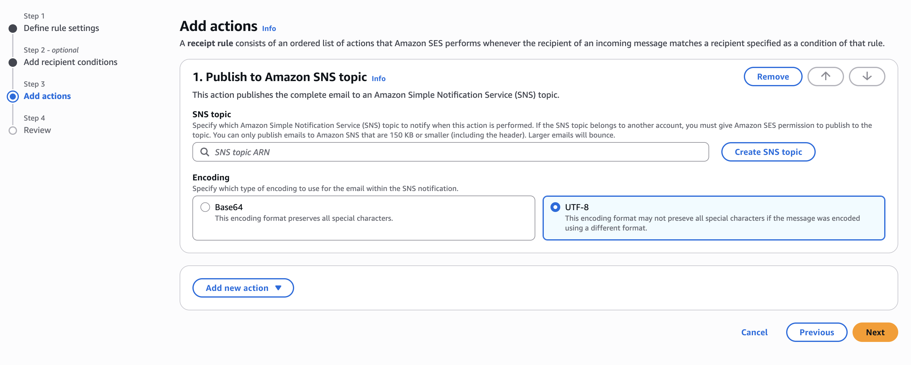
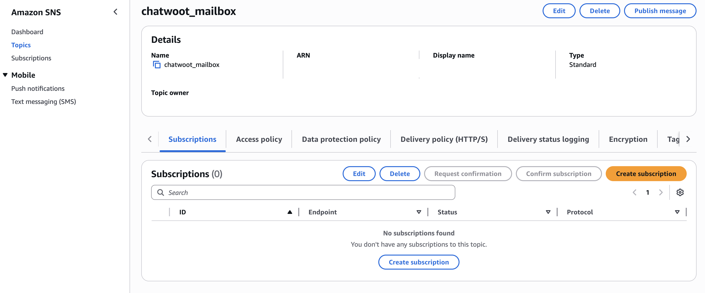
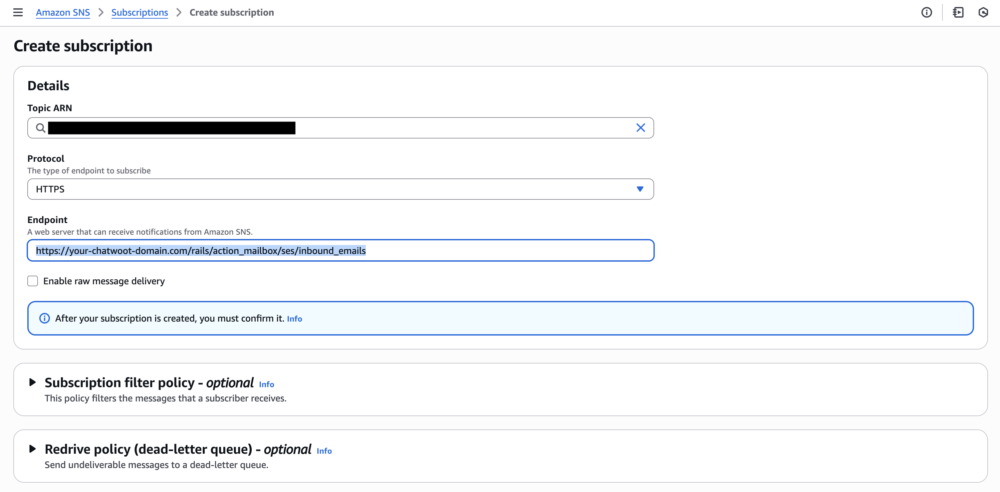

This guide explains how to set up Amazon SES as the incoming email (ingress) provider for your self-hosted Chatwoot installation. If you plan to use Chatwoot’s email forwarding option and want SES to handle inbound mail delivery into Chatwoot, this documentation is for you.


### Who is this for?

This setup is intended for:

- Teams running self‑hosted Chatwoot.
- Users who want to use Amazon SES to receive inbound emails.
- Workspaces that want to configure forwarding rules rather than using IMAP/OAuth connections to bring emails into Chatwoot.

If you are using Chatwoot Cloud, you do not need this setup.

### Architecture

At a high level, the flow looks like this:



1. An email is sent to your domain (e.g., support@yourdomain.com).
2. Amazon SES receives the email.
3. SES forwards the message to an SNS Topic.
4. SNS publishes the message payload to a Chatwoot email ingress endpoint.
5. Chatwoot processes the payload and creates/updates a conversation.

### Prerequisites

Before you begin, you should have:

- Access to AWS SES, SNS, Route53 (or your DNS provider).
- A self‑hosted Chatwoot installation reachable over HTTPS.

### Step 1: Verify Your Domain in Amazon SES

Amazon SES must verify that you own the domain before it can receive mail.

1. Log in to AWS Console → SES → Identities.
2. Click Create Identity.
3. Choose Domain.
4. Enter the domain you want to receive email for.
5. Amazon SES will show DNS records you must add:
   - DKIM (CNAME) records
   - SPF (TXT) record
   - DMARC (TXT) record (optional but recommended)
6. Add all records to your DNS provider.
7. Wait for the identity status to become verified.

### Step 2: Configure MX Records to Route Email to SES

SES must become the inbound email handler for your domain.

1. In SES, open Configuration → Email Receiving.
2. Locate the MX record value for your region (example: 10 inbound-smtp.us-east-1.amazonaws.com).
3. Go to your DNS provider.
4. Add an MX record:
   - Priority: 10
   - Value: `inbound-smtp.<region>.amazonaws.com`


Once this is set, your domain will start routing incoming mail to SES. If you have any doubts about setting this up, read more at [AWS SES documentation](https://docs.aws.amazon.com/ses/latest/dg/receiving-email-setting-up.html).


### Step 3: Configure SES to Publish Inbound Emails to SNS

Chatwoot reads incoming messages via SNS notifications.

Go to SES → Email Receiving → Rule Sets.


Create a Rule Set if you don’t have one.



Add a new rule:
   - Recipients → Add your inbound email (e.g. support@yourdomain.com) or ignore this field since it would forward every email to SNS (which is better if you have more than one email channel)
   - Actions → Publish to Amazon SNS topic
   - Select your SNS topic.
   - Make sure that you select the Encoding as UTF-8.



Save and enable the rule.

Note: You don't have to turn on Transport Layer Security (TLS) or Spam and virus scanning for this setup. Now SES will publish every inbound email event to your SNS topic.


### Step 4: Configure Chatwoot Environment Variables

Before creating the SNS subscription, you must configure two environment variables in your Chatwoot installation:

```bash
RAILS_INBOUND_EMAIL_SERVICE=ses

# SNS topic ARN for ActionMailbox (format: arn:aws:sns:region:account-id:topic-name)
# Configure only after you create the SNS topic in AWS
ACTION_MAILBOX_SES_SNS_TOPIC=
```

Why this matters:
Chatwoot needs to know that SES will be used for inbound email. Chatwoot must be ready to valid the SNS topic once the subscription is created.

### Step 5: Create SNS Subscription to Forward to Chatwoot

SNS needs to send the email payload directly to Chatwoot.

Go to SNS → Topics. Open the topic you created. Click Create Subscription.



Set:
   - Protocol: HTTPS
   - Endpoint: Your Chatwoot email ingress endpoint `https://chatwoot.example.com/rails/action_mailbox/ses/inbound_emails`



Save.

Note: SNS will send a confirmation request. Chatwoot will automatically confirm the subscription.


### Step 6: Add Email Channel in Chatwoot

1. Go to your Chatwoot account. Settings → Inboxes → Add Inbox.
2. Choose Email -> Other Providers.
3. Use any email address from the domain that is configured in SES.

After this you should see incoming email in your inbox.


### Troubleshooting

Emails not appearing in Chatwoot:
- Check SES → SNS → Subscription delivery logs.
- Check SNS subscription status.
- Check Chatwoot logs for any errors.
- Ensure Chatwoot server is reachable publicly.
- Check if MX records propagated.

SNS subscription not confirmed:
- Ensure Chatwoot server is reachable publicly.
- Verify system time and SSL certificates on your server. If you are testing this in local environment, you can use tools like ngrok to expose your Chatwoot server to the internet. Make sure that you are using `openssl<=3.5`.
